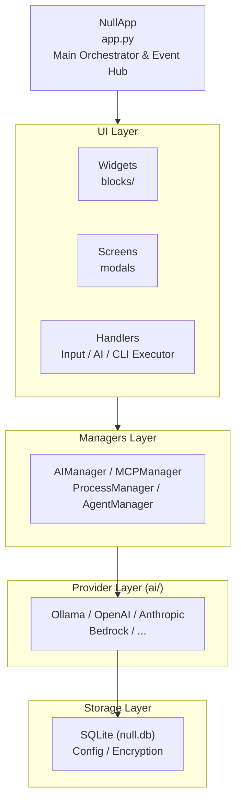
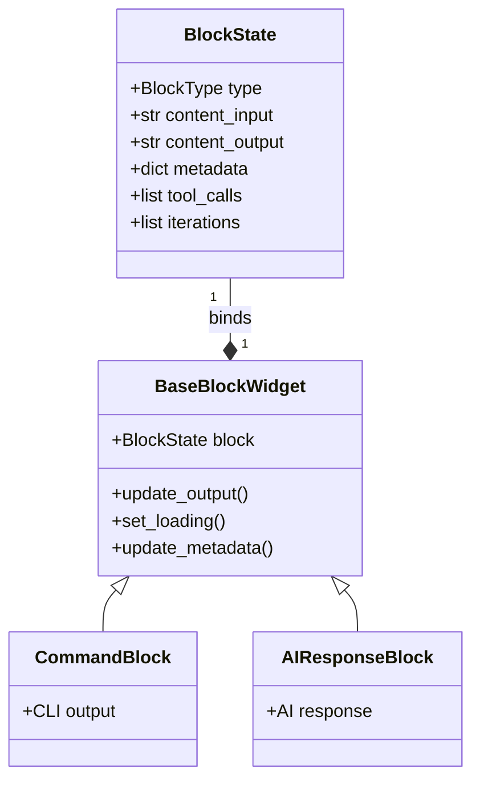
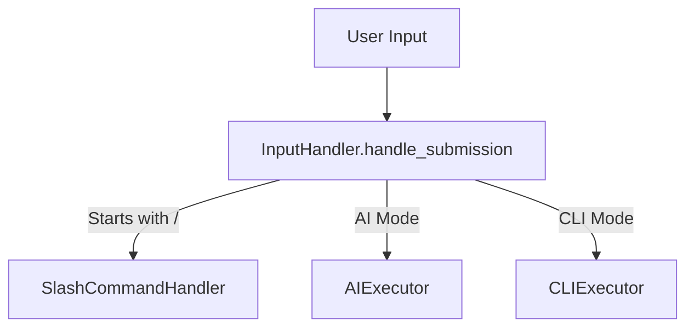
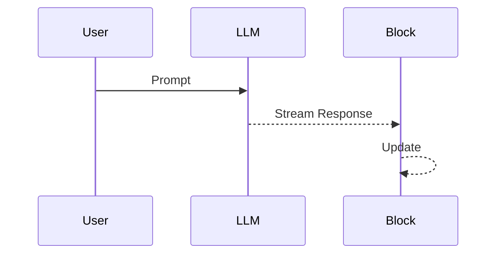
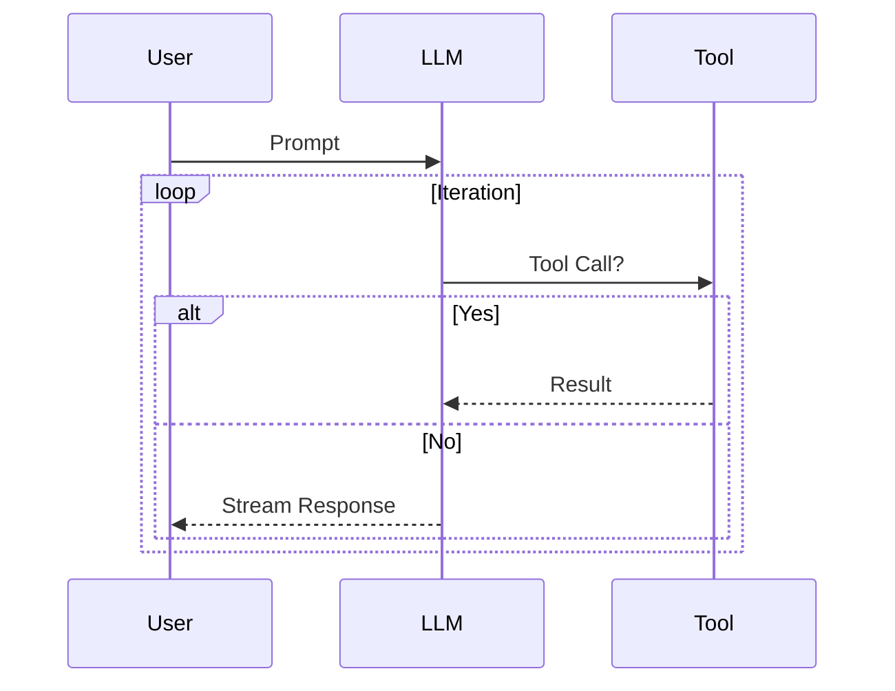
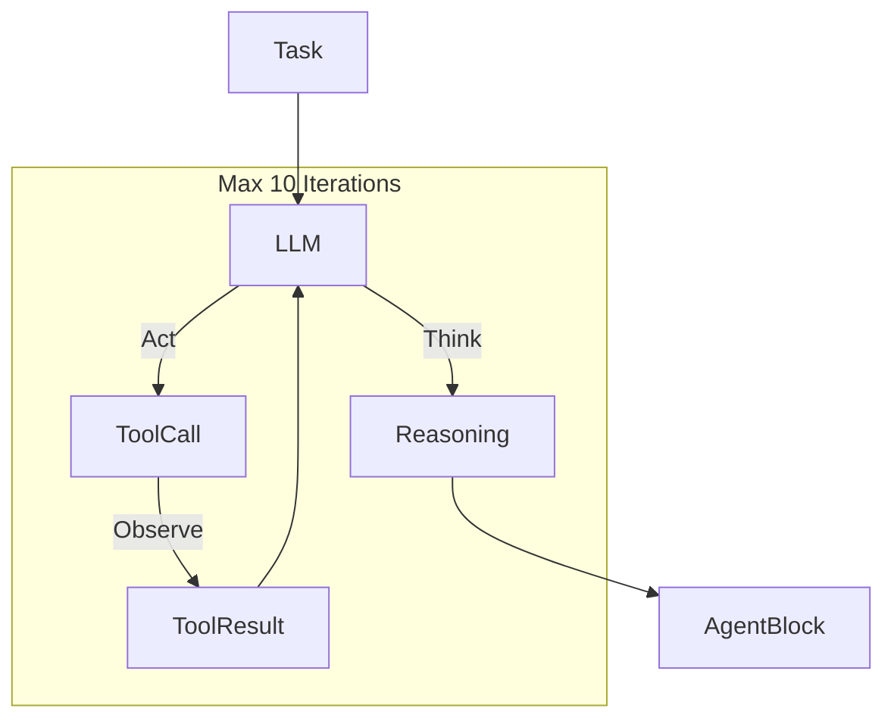
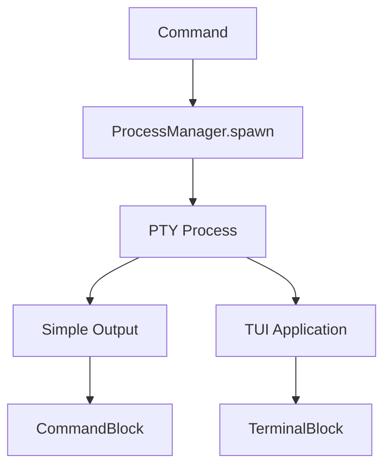
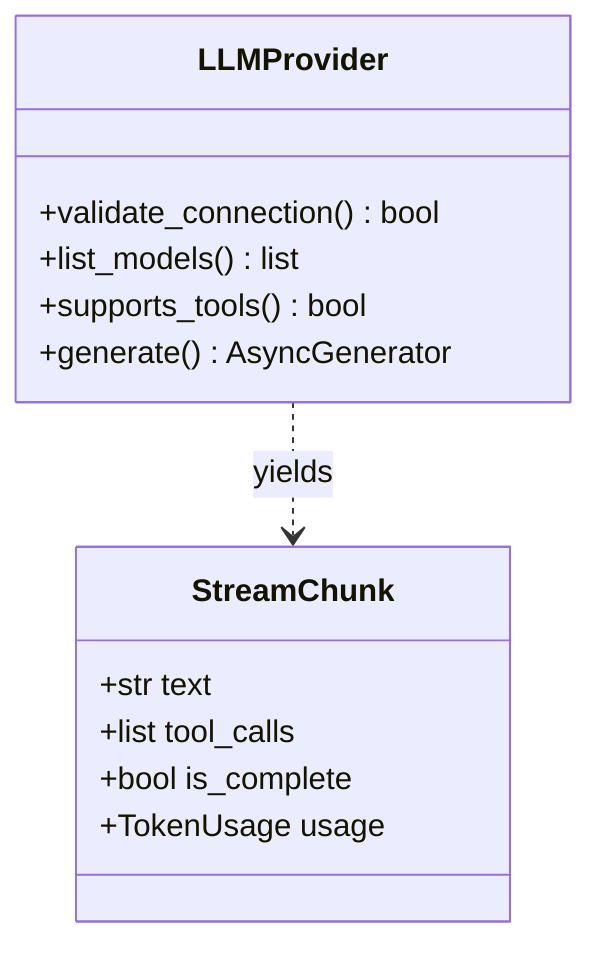
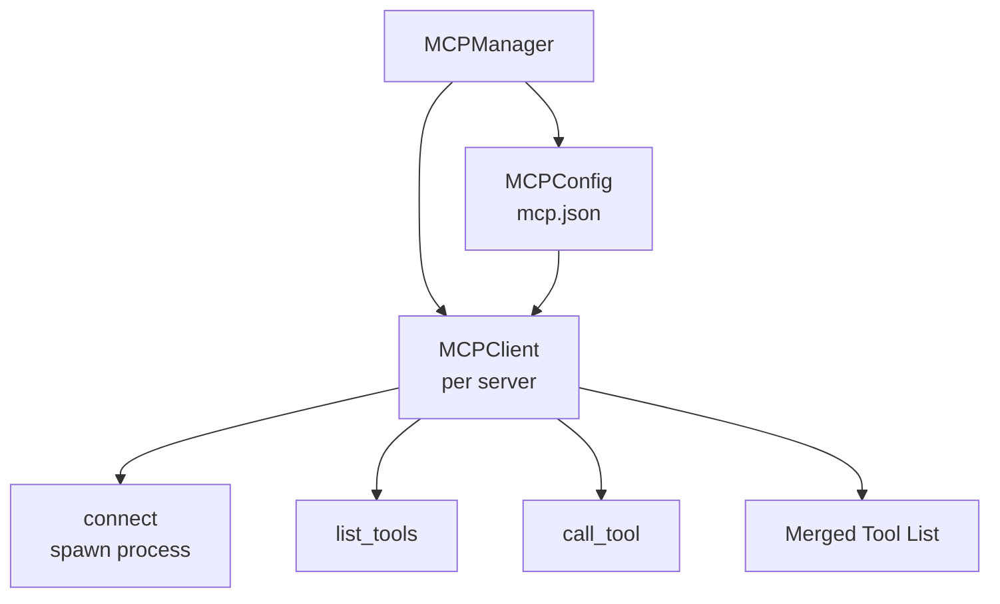
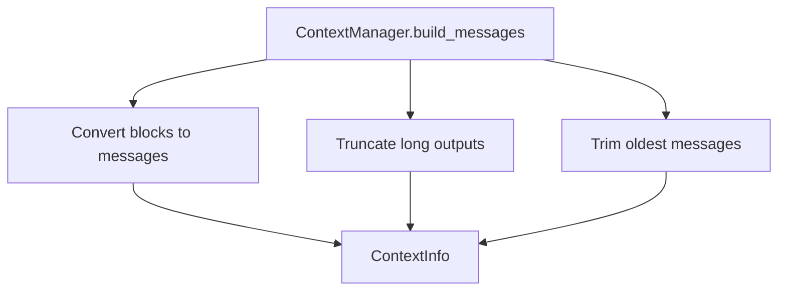

# Null Terminal Architecture

Null Terminal is a modern, AI-integrated terminal emulator built on the [Textual](https://textual.textualize.io/) framework. It combines a robust TUI with pluggable AI providers to create a seamless "Chat with your Code" experience.

## System Overview

The application is structured around four core pillars:
1.  **The UI Layer** (Textual Widgets & Screens)
2.  **The AI Layer** (Providers & Streaming)
3.  **The Handler Layer** (Execution & Routing)
4.  **The State Layer** (Configuration, Context & Managers)



---

## 1. The UI Layer

### NullApp (`app.py`)

The `NullApp` class is the central hub. It:
- Initializes all managers and handlers
- Composes the main UI layout
- Routes messages between widgets
- Manages the block history list

```python
class NullApp(App):
    def __init__(self):
        # Initialize managers
        self.ai_manager = AIManager()
        self.mcp_manager = MCPManager()
        self.process_manager = ProcessManager()
        self.agent_manager = AgentManager()
        
        # Initialize handlers
        self.command_handler = SlashCommandHandler(self)
        self.execution_handler = ExecutionHandler(self)
        self.input_handler = InputHandler(self)
```

### Core Widgets

| Widget | Location | Purpose |
|--------|----------|---------|
| `InputController` | `widgets/input.py` | User input with history and suggestions |
| `HistoryViewport` | `widgets/history.py` | Scrollable container for blocks |
| `StatusBar` | `widgets/status_bar.py` | Mode, tokens, cost, git status display |
| `Sidebar` | `widgets/sidebar.py` | File tree and context panel |
| `CommandPalette` | `widgets/palette.py` | Quick command access (Ctrl+P) |

### Block Architecture (`widgets/blocks/`)

Every interaction creates a **Block** - a distinct visual unit in the history.



**Block Types:**
- `COMMAND` - Shell command execution
- `AI_QUERY` - User prompt to AI
- `AI_RESPONSE` - AI response with optional tool calls
- `AGENT_RESPONSE` - Multi-iteration agent response
- `SYSTEM_MSG` - System notifications

### Screens (`screens/`)

Modal screens for focused interactions:

| Screen | Trigger | Purpose |
|--------|---------|---------|
| `HelpScreen` | F1, `/help` | Keybindings and commands |
| `ModelListScreen` | F2, `/model` | Model selection |
| `ConfigScreen` | F3, `/settings` | Application settings |
| `ProvidersScreen` | F4, `/providers` | Provider management |
| `ToolApprovalScreen` | Auto | Tool execution approval |
| `TodoScreen` | `/todo` | Task management |

---

## 2. The Handler Layer

Handlers decouple execution logic from the UI.

### Input Routing (`handlers/input.py`)



### AI Executor (`handlers/ai_executor.py`)

The complexity hotspot. Manages three execution modes:

**1. Standard Chat**


**2. Tool-Augmented Chat** (max 3 iterations)


**3. Agent Mode** (max 10 iterations)


### CLI Executor (`handlers/cli_executor.py`)

Executes shell commands via PTY:



---

## 3. The AI Layer

### Provider Architecture (`ai/`)



### Supported Providers

| Category | Providers |
|----------|-----------|
| **Local** | Ollama, LM Studio, Llama.cpp, NVIDIA NIM |
| **Cloud** | OpenAI, Anthropic, Google (Vertex/AI Studio), Azure, Bedrock |
| **Alternative** | Groq, Mistral, DeepSeek, Cohere, Together, xAI, OpenRouter |

### AIManager (`ai/manager.py`)

Orchestrates provider lifecycle:

```python
class AIManager:
    def get_active_provider() -> LLMProvider
    def list_all_models() -> list[ModelInfo]  # Parallel fetch from all providers
    def set_provider(name: str, model: str)
```

### Thinking Strategies (`ai/thinking.py`)

Extracts reasoning from different model formats:

| Strategy | Format | Models |
|----------|--------|--------|
| `XMLTagsStrategy` | `<think>...</think>` | DeepSeek, Claude |
| `JSONStructuredStrategy` | `{"thinking": "..."}` | GPT-4 |
| `NativeStrategy` | Built-in reasoning | o1, DeepSeek-R1 |

---

## 4. The State Layer

### Managers (`managers/`)

| Manager | Responsibility |
|---------|----------------|
| `AIManager` | Provider lifecycle, model selection |
| `MCPManager` | MCP server connections and tool discovery |
| `ProcessManager` | Background process tracking |
| `AgentManager` | Agent session state and history |
| `BranchManager` | Conversation branching |

### MCP Integration (`mcp/`)



### Configuration (`config/`)

```
~/.null/
├── config.json      # User settings (theme, provider, etc.)
├── null.db          # SQLite (sessions, encrypted API keys)
├── mcp.json         # MCP server configurations
├── themes/          # Custom TCSS themes
├── prompts/         # Custom system prompts
└── .key             # Encryption key (or OS keyring)
```

### Context Management (`context.py`)

Builds the message array for LLM calls:



---

## Event Flow Examples

### Example 1: User Sends an AI Query

```
1. User types "Explain this code" + Enter
2. InputController emits Submitted message
3. InputHandler.handle_submission()
   └── AI mode? Yes → AIExecutor.execute_ai()
4. AIExecutor:
   a. Creates AI_QUERY block in history
   b. Creates AI_RESPONSE block (loading)
   c. Gets context from ContextManager
   d. Calls provider.generate(messages)
   e. Streams chunks to AIResponseBlock
   f. Updates token usage in StatusBar
5. On completion: Block shows final response
```

### Example 2: Agent Mode Task

```
1. User enables /agent, sends "Create a hello.py file"
2. AIExecutor._execute_agent_mode():
   
   Iteration 1:
   ├── LLM reasons about task
   ├── Returns tool_call: write_file("hello.py", "...")
   ├── ToolApprovalScreen shown
   ├── User approves
   └── Tool executes, result sent to LLM
   
   Iteration 2:
   ├── LLM confirms file created
   └── No more tool calls → Complete
   
3. AgentResponseBlock shows all iterations
```

### Example 3: MCP Tool Usage

```
1. AI generates tool_call for MCP tool "brave_search"
2. AIExecutor._process_tool_calls():
   a. Checks if tool is MCP (mcp_ prefix)
   b. Calls MCPManager.call_tool("brave_search", args)
   c. MCPClient sends JSON-RPC to server process
   d. Server executes, returns result
   e. Result fed back to LLM
```

---

## Key Design Patterns

### 1. Message Passing (Textual)
Widgets communicate via `post_message()` rather than direct method calls:
```python
class BaseBlockWidget(Static):
    class RetryRequested(Message):
        def __init__(self, block_id: str):
            self.block_id = block_id
            super().__init__()
```

### 2. Reactive Properties
UI state uses Textual's reactive system:
```python
class StatusBar(Static):
    mode = reactive("CLI")
    session_cost = reactive(0.0)
    
    def watch_mode(self, mode: str):
        self._update_display()
```

### 3. Factory Pattern
Provider instantiation via `AIFactory`:
```python
provider = AIFactory.get_provider("openai", api_key="...", model="gpt-4o")
```

### 4. Facade Pattern
`ExecutionHandler` provides unified interface:
```python
class ExecutionHandler:
    def __init__(self, app):
        self.ai_executor = AIExecutor(app)
        self.cli_executor = CLIExecutor(app)
```

---

## Performance Considerations

### Streaming
- AI responses stream token-by-token
- `UIBuffer` batches updates to prevent UI flicker
- Tool results shown progressively

### Concurrency
- All I/O is async (`httpx`, `asyncio.subprocess`)
- Textual workers for background tasks
- Parallel model fetching across providers

### Memory
- Long outputs truncated in context
- Block history can be cleared
- Session export offloads to disk

---

## Extension Points

| To Add | Where | Pattern |
|--------|-------|---------|
| New AI Provider | `ai/newprovider.py` + `ai/factory.py` | Inherit `LLMProvider` |
| New Command | `commands/` + `handler.py` | `cmd_` method + registry |
| New Widget | `widgets/` | Inherit from Textual widget |
| New Block Type | `widgets/blocks/` + `models.py` | Add `BlockType`, create widget |
| New MCP Server | `~/.null/mcp.json` | Config entry |
| New Theme | `~/.null/themes/` | TCSS file |
