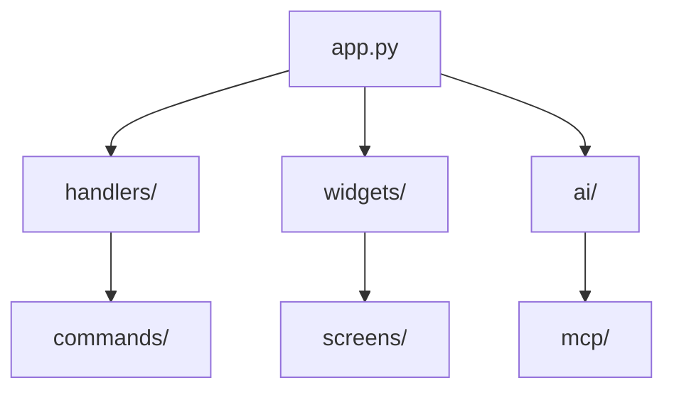

# Feature Specifications

This document contains detailed design specifications for proposed Null Terminal features.

---

## 1. Smart Command Suggestions

### Overview
AI-powered command suggestions based on context, history, and current state.

### User Story
> As a user, I want intelligent command suggestions that understand my current context (directory, git status, recent commands) so I can work faster.

### Current State
- `CommandSuggester` provides static slash command suggestions
- History-based completion via arrow keys
- No contextual awareness

### Proposed Design

#### Architecture
```
┌─────────────────────────────────────────────────────────┐
│                  SuggestionEngine                       │
├─────────────────────────────────────────────────────────┤
│  ┌─────────────┐  ┌─────────────┐  ┌─────────────────┐  │
│  │  History    │  │  Context    │  │  AI-Powered     │  │
│  │  Provider   │  │  Provider   │  │  Provider       │  │
│  └──────┬──────┘  └──────┬──────┘  └────────┬────────┘  │
│         │                │                  │           │
│         └────────────────┼──────────────────┘           │
│                          │                              │
│                    ┌─────┴─────┐                        │
│                    │  Ranker   │                        │
│                    └─────┬─────┘                        │
│                          │                              │
│                    ┌─────┴─────┐                        │
│                    │ Top N     │                        │
│                    │ Suggestions                        │
│                    └───────────┘                        │
└─────────────────────────────────────────────────────────┘
```

#### Components

**1. HistoryProvider**
```python
class HistoryProvider:
    def suggest(self, prefix: str, limit: int = 5) -> list[Suggestion]:
        """Return commands from history matching prefix."""
        # Weighted by recency and frequency
```

**2. ContextProvider**
```python
class ContextProvider:
    def suggest(self, context: ContextState) -> list[Suggestion]:
        """Suggest based on current state."""
        # - Directory contents (files suggest relevant commands)
        # - Git status (dirty repo suggests git commands)
        # - Recent errors (suggest fixes)
        # - Time of day (morning: git pull)
```

**3. AIProvider** (optional, requires AI mode)
```python
class AISuggestionProvider:
    async def suggest(self, input: str, context: ContextState) -> list[Suggestion]:
        """Use LLM to suggest contextual commands."""
        # Lightweight prompt, cached responses
```

**4. Suggestion Model**
```python
@dataclass
class Suggestion:
    command: str
    description: str
    source: Literal["history", "context", "ai"]
    score: float  # 0.0 - 1.0
    icon: str  # For display
```

#### UI Integration

```
┌─────────────────────────────────────────────┐
│ $ git sta█                                  │
├─────────────────────────────────────────────┤
│ ▸ git status         Show working tree     │
│   git stash          Stash changes         │
│   git stash pop      Apply stashed changes │
└─────────────────────────────────────────────┘
```

- Tab to accept top suggestion
- Arrow keys to navigate
- Escape to dismiss
- Inline ghost text for top suggestion

#### Configuration
```json
{
  "suggestions": {
    "enabled": true,
    "ai_enabled": false,
    "max_suggestions": 5,
    "min_chars": 2,
    "sources": ["history", "context", "ai"]
  }
}
```

#### Implementation Steps
1. Create `SuggestionEngine` base class
2. Implement `HistoryProvider` (parse command history)
3. Implement `ContextProvider` (git, files, errors)
4. Create suggestion dropdown widget
5. Add ghost text overlay to input
6. (Optional) Implement `AIProvider`

#### Effort Estimate
- Core engine: 2 days
- UI integration: 1 day
- AI provider: 1 day
- Testing: 1 day
- **Total: 5 days**

---

## 2. Conversation Branching UI

### Overview
Visual interface for exploring conversation branches and comparing AI responses.

### User Story
> As a user, I want to explore alternative AI responses by branching conversations, so I can compare different approaches without losing context.

### Current State
- `ForkRequested` message exists in `BaseBlockWidget`
- `BranchManager` tracks branches
- No visual UI for branch navigation

### Proposed Design

#### Data Model
```python
@dataclass
class ConversationBranch:
    id: str
    parent_id: str | None
    parent_block_id: str | None  # Block where branch diverged
    created_at: datetime
    name: str  # Auto-generated or user-defined
    blocks: list[BlockState]

class BranchManager:
    branches: dict[str, ConversationBranch]
    current_branch_id: str
    
    def fork(self, at_block_id: str) -> ConversationBranch
    def switch(self, branch_id: str)
    def merge(self, source_id: str, target_id: str)
    def delete(self, branch_id: str)
```

#### UI Components

**1. Branch Indicator (Status Bar)**
```
┌─────────────────────────────────────────────────────────┐
│ CLI │ main (3 branches) │ gpt-4o │ 1.2K tokens │ $0.02 │
└─────────────────────────────────────────────────────────┘
         ↑
    Click to open Branch Navigator
```

**2. Branch Navigator (Sidebar Panel)**
```
┌─────────────────────┐
│ Branches            │
├─────────────────────┤
│ ● main              │
│   └─ fix-attempt-1  │
│   └─ refactor-v2    │
│ ○ experiment        │
├─────────────────────┤
│ [+ New Branch]      │
└─────────────────────┘
```

**3. Branch Diff View (Modal)**
```
┌─────────────────────────────────────────────────────────┐
│ Compare: main ↔ fix-attempt-1                      [×]  │
├─────────────────────────────────────────────────────────┤
│ main                    │ fix-attempt-1                 │
│ ─────────────────────── │ ───────────────────────────── │
│ def process():          │ def process():                │
│   for item in items:    │   items = [x for x in        │
│     handle(item)        │            items if valid(x)]│
│                         │   for item in items:          │
│                         │     handle(item)              │
└─────────────────────────────────────────────────────────┘
```

**4. Block Fork Button**
Each AI response block gets a fork icon:
```
┌─────────────────────────────────────────────────────────┐
│ AI Response                              [↗] [📋] [🔄]  │
│                                                    ↑    │
│ Here's how to refactor...                     Fork button
└─────────────────────────────────────────────────────────┘
```

#### Keyboard Shortcuts
| Shortcut | Action |
|----------|--------|
| `Ctrl+B` | Open branch navigator |
| `Ctrl+Shift+B` | Create branch at current position |
| `Alt+Left/Right` | Switch between sibling branches |

#### Implementation Steps
1. Extend `BranchManager` with full CRUD
2. Create `BranchNavigator` sidebar widget
3. Add branch indicator to `StatusBar`
4. Implement fork action in `BaseBlockWidget`
5. Create `BranchDiffScreen` modal
6. Add persistence (SQLite)
7. Testing

#### Effort Estimate
- Data model: 1 day
- BranchNavigator widget: 2 days
- Diff view: 1 day
- Integration: 1 day
- Persistence: 1 day
- **Total: 6 days**

---

## 3. Workflow Templates / Recipes

### Overview
Save and replay multi-step AI agent sessions as reusable templates.

### User Story
> As a power user, I want to save successful agent workflows as templates, so I can reuse them with different inputs.

### Current State
- Agent mode executes multi-step tasks
- Sessions can be exported to markdown
- No template/replay functionality

### Proposed Design

#### Data Model
```python
@dataclass
class WorkflowStep:
    type: Literal["prompt", "tool", "checkpoint"]
    content: str  # Prompt text or tool name
    arguments: dict  # Tool arguments or prompt variables
    expected_output: str | None  # For validation
    
@dataclass
class Workflow:
    id: str
    name: str
    description: str
    tags: list[str]
    variables: dict[str, str]  # Placeholders like {{filename}}
    steps: list[WorkflowStep]
    created_at: datetime
    source: Literal["local", "community"]
```

#### File Format (`~/.null/workflows/`)
```yaml
# debug-python.yaml
name: Debug Python Error
description: Analyze and fix Python errors with step-by-step debugging
tags: [python, debugging, fix]
variables:
  error_message: "The error you encountered"
  file_path: "Path to the file with the error"

steps:
  - type: prompt
    content: |
      Analyze this Python error:
      ```
      {{error_message}}
      ```
      In file: {{file_path}}
      
      First, read the file to understand context.
  
  - type: tool
    name: read_file
    arguments:
      path: "{{file_path}}"
  
  - type: prompt
    content: |
      Based on the file content, identify the bug and suggest a fix.
      Use write_file to apply the fix.
  
  - type: checkpoint
    content: "Confirm fix before continuing"
```

#### UI Components

**1. Workflow Browser (`/workflow` command)**
```
┌─────────────────────────────────────────────────────────┐
│ Workflows                                          [×]  │
├─────────────────────────────────────────────────────────┤
│ 🔧 Debug Python Error                                   │
│    Analyze and fix Python errors                        │
│    Tags: python, debugging                              │
│                                                         │
│ 📝 Code Review                                          │
│    Review code changes and suggest improvements         │
│    Tags: review, quality                                │
│                                                         │
│ 🚀 Deploy Checklist                                     │
│    Pre-deployment verification workflow                 │
│    Tags: devops, deploy                                 │
├─────────────────────────────────────────────────────────┤
│ [+ Create New] [Import] [Browse Community]              │
└─────────────────────────────────────────────────────────┘
```

**2. Workflow Runner**
```
┌─────────────────────────────────────────────────────────┐
│ Running: Debug Python Error                        [■]  │
├─────────────────────────────────────────────────────────┤
│ Variables:                                              │
│   error_message: [TypeError: 'NoneType' object...]      │
│   file_path: [src/parser.py                       ]     │
│                                                         │
│                              [Run Workflow]             │
└─────────────────────────────────────────────────────────┘
```

**3. Save Session as Workflow**
After successful agent session:
```
┌─────────────────────────────────────────────────────────┐
│ Save as Workflow                                   [×]  │
├─────────────────────────────────────────────────────────┤
│ Name: [                                           ]     │
│ Description: [                                    ]     │
│ Tags: [                                           ]     │
│                                                         │
│ Detected Variables:                                     │
│ ☑ filename → {{filename}}                               │
│ ☑ function_name → {{function_name}}                     │
│ ☐ specific_value (keep as-is)                           │
│                                                         │
│                      [Cancel] [Save Workflow]           │
└─────────────────────────────────────────────────────────┘
```

#### Commands
| Command | Description |
|---------|-------------|
| `/workflow` | Browse workflows |
| `/workflow run <name>` | Run a workflow |
| `/workflow save [name]` | Save current session as workflow |
| `/workflow import <file>` | Import from YAML |
| `/workflow export <name>` | Export to YAML |

#### Implementation Steps
1. Define Workflow data model
2. Create YAML parser/writer
3. Implement `WorkflowManager`
4. Build workflow browser screen
5. Create workflow runner with variable substitution
6. Add "Save as Workflow" to agent completion
7. (Future) Community workflow sharing

#### Effort Estimate
- Data model & parsing: 1 day
- WorkflowManager: 2 days
- Browser UI: 2 days
- Runner & variable substitution: 2 days
- Save from session: 1 day
- **Total: 8 days**

---

## 4. Enhanced RAG with Semantic Caching

### Overview
Improve RAG performance with SQLite-based vector storage and semantic result caching.

### User Story
> As a user with large codebases, I want faster and more accurate code search that remembers previous queries.

### Current State
- `VectorStore` uses JSON file persistence
- Pure Python cosine similarity
- No query caching
- Full re-index required for updates

### Proposed Design

#### Architecture
```
┌─────────────────────────────────────────────────────────┐
│                    RAGManager                           │
├─────────────────────────────────────────────────────────┤
│  ┌─────────────────┐  ┌─────────────────────────────┐   │
│  │  QueryCache     │  │  VectorStore (SQLite)       │   │
│  │  (Semantic)     │  │  - FTS5 for text search     │   │
│  └────────┬────────┘  │  - Vector similarity        │   │
│           │           │  - Incremental updates       │   │
│           │           └─────────────────────────────┘   │
│           │                        │                    │
│           └────────────────────────┤                    │
│                                    │                    │
│                         ┌──────────┴──────────┐         │
│                         │   HybridSearch      │         │
│                         │   (Vector + FTS5)   │         │
│                         └─────────────────────┘         │
└─────────────────────────────────────────────────────────┘
```

#### SQLite Schema
```sql
-- Documents table
CREATE TABLE documents (
    id TEXT PRIMARY KEY,
    source TEXT NOT NULL,
    content TEXT NOT NULL,
    chunk_index INTEGER,
    updated_at TIMESTAMP DEFAULT CURRENT_TIMESTAMP
);

-- Vector embeddings (stored as BLOB)
CREATE TABLE embeddings (
    doc_id TEXT PRIMARY KEY REFERENCES documents(id),
    vector BLOB NOT NULL,
    model TEXT NOT NULL
);

-- Full-text search
CREATE VIRTUAL TABLE documents_fts USING fts5(
    content,
    content='documents',
    content_rowid='rowid'
);

-- Query cache
CREATE TABLE query_cache (
    query_hash TEXT PRIMARY KEY,
    query_text TEXT,
    query_vector BLOB,
    results TEXT,  -- JSON array of doc_ids with scores
    created_at TIMESTAMP DEFAULT CURRENT_TIMESTAMP,
    hit_count INTEGER DEFAULT 0
);

-- File modification tracking
CREATE TABLE file_index (
    path TEXT PRIMARY KEY,
    mtime REAL,
    hash TEXT
);
```

#### Semantic Cache
```python
class SemanticCache:
    def __init__(self, similarity_threshold: float = 0.92):
        self.threshold = similarity_threshold
    
    async def get(self, query: str, query_vector: list[float]) -> CacheHit | None:
        """Find semantically similar cached query."""
        # 1. Hash lookup for exact match
        # 2. Vector similarity for semantic match
        # 3. Return cached results if similar enough
    
    async def set(self, query: str, query_vector: list[float], results: list):
        """Cache query results."""
```

#### Incremental Indexing
```python
class IncrementalIndexer:
    async def update(self, path: Path):
        """Update index for changed files only."""
        # 1. Scan directory for mtime changes
        # 2. Hash changed files
        # 3. Re-chunk and re-embed only changed files
        # 4. Update FTS index
```

#### Hybrid Search
```python
class HybridSearch:
    async def search(
        self, 
        query: str, 
        limit: int = 10,
        vector_weight: float = 0.7,
        fts_weight: float = 0.3
    ) -> list[SearchResult]:
        """Combine vector similarity with FTS5 ranking."""
        # 1. Get vector results
        # 2. Get FTS5 results
        # 3. Merge and re-rank with weights
```

#### Configuration
```json
{
  "rag": {
    "storage": "sqlite",
    "cache_enabled": true,
    "cache_similarity_threshold": 0.92,
    "cache_max_entries": 1000,
    "hybrid_search": true,
    "vector_weight": 0.7,
    "chunk_size": 1000,
    "chunk_overlap": 200
  }
}
```

#### Implementation Steps
1. Create SQLite schema and migration
2. Implement `SQLiteVectorStore`
3. Add FTS5 integration
4. Build `SemanticCache`
5. Implement `IncrementalIndexer`
6. Create `HybridSearch`
7. Migration from JSON to SQLite
8. Performance testing

#### Effort Estimate
- SQLite schema: 1 day
- VectorStore migration: 2 days
- Semantic cache: 2 days
- Incremental indexing: 2 days
- Hybrid search: 1 day
- Testing & optimization: 2 days
- **Total: 10 days**

---

## 5. Session Sharing & Collaboration

### Overview
Share conversation sessions via URLs and enable team workspace features.

### User Story
> As a team member, I want to share my AI conversation with colleagues so we can collaborate on problem-solving.

### Current State
- Sessions export to markdown/JSON files
- No sharing mechanism
- Single-user only

### Proposed Design

#### Sharing Flow
```
┌─────────┐    ┌─────────────┐    ┌──────────────┐    ┌─────────┐
│  User   │───>│  /share     │───>│  Share       │───>│  URL    │
│         │    │  command    │    │  Service     │    │ Generated
└─────────┘    └─────────────┘    └──────────────┘    └─────────┘
                                        │
                                        ▼
                               ┌──────────────────┐
                               │  Cloud Storage   │
                               │  (Optional S3)   │
                               └──────────────────┘
```

#### Share Types

**1. Public Link (Expiring)**
```
https://null.sh/s/abc123def456
```
- Read-only
- 7-day expiration (configurable)
- No authentication required

**2. Team Workspace**
```
https://null.sh/team/acme/sessions/project-debug-001
```
- Team members can view/fork
- Persistent storage
- Requires team account

**3. Self-Hosted**
```
https://your-server.com/null/s/abc123
```
- Deploy your own share server
- Full control over data

#### Data Format
```python
@dataclass
class SharedSession:
    id: str
    created_by: str
    created_at: datetime
    expires_at: datetime | None
    access_level: Literal["public", "team", "private"]
    
    # Session data (encrypted for private)
    blocks: list[BlockState]
    metadata: dict
    
    # Optional
    team_id: str | None
    fork_count: int
    view_count: int
```

#### Commands
| Command | Description |
|---------|-------------|
| `/share` | Share current session (public link) |
| `/share team` | Share to team workspace |
| `/share --expires 24h` | Share with expiration |
| `/import <url>` | Import shared session |

#### UI Components

**1. Share Dialog**
```
┌─────────────────────────────────────────────────────────┐
│ Share Session                                      [×]  │
├─────────────────────────────────────────────────────────┤
│ Visibility:                                             │
│   ○ Public (anyone with link)                           │
│   ○ Team (Acme Corp members)                            │
│   ○ Private (invite only)                               │
│                                                         │
│ Expires: [7 days ▼]                                     │
│                                                         │
│ Include:                                                │
│   ☑ Full conversation                                   │
│   ☐ Tool call results                                   │
│   ☐ Token/cost information                              │
│                                                         │
│ ┌─────────────────────────────────────────────────────┐ │
│ │ https://null.sh/s/abc123def456              [Copy]  │ │
│ └─────────────────────────────────────────────────────┘ │
│                                                         │
│                              [Cancel] [Create Link]     │
└─────────────────────────────────────────────────────────┘
```

**2. Shared Session Viewer**
```
┌─────────────────────────────────────────────────────────┐
│ Shared Session                          [Fork] [Import] │
│ by @user • 2 days ago • 15 views                        │
├─────────────────────────────────────────────────────────┤
│                                                         │
│  [Read-only session view with blocks]                   │
│                                                         │
└─────────────────────────────────────────────────────────┘
```

#### Backend Requirements
- Share service API (optional, can be self-hosted)
- Cloud storage for session data
- URL shortener/ID generation
- Expiration cleanup job

#### Configuration
```json
{
  "sharing": {
    "enabled": true,
    "service_url": "https://null.sh",
    "default_expiration": "7d",
    "include_tools": false,
    "self_hosted": false,
    "s3_bucket": null
  }
}
```

#### Implementation Steps
1. Define sharing protocol/format
2. Create share service API spec
3. Implement `/share` command
4. Build share dialog UI
5. Implement session viewer
6. (Optional) Self-hosted share server
7. (Optional) Team workspace features

#### Effort Estimate
- Data format: 1 day
- Share command & dialog: 2 days
- Service integration: 3 days
- Session viewer: 2 days
- Self-hosted option: 3 days
- **Total: 11 days**

---

## 6. Streaming Tool Results

### Overview
Display tool execution results in real-time rather than waiting for completion.

### User Story
> As a user running long commands via AI tools, I want to see output as it happens rather than waiting for completion.

### Current State
- Tool results shown after completion in accordion
- `run_command` waits for full output
- No streaming indication during execution

### Proposed Design

#### Streaming Architecture
```
┌─────────────┐    ┌──────────────┐    ┌─────────────────┐
│  AI calls   │───>│  ToolRunner  │───>│  StreamingTool  │
│  tool       │    │  (async)     │    │  (PTY/Process)  │
└─────────────┘    └──────────────┘    └────────┬────────┘
                          │                     │
                          │                     │ stdout chunks
                          ▼                     ▼
                   ┌──────────────────────────────┐
                   │   ToolProgressWidget         │
                   │   (real-time output view)    │
                   └──────────────────────────────┘
```

#### Enhanced Tool Accordion
```
┌─────────────────────────────────────────────────────────┐
│ 🔧 run_command: npm install                    [▼] [■]  │
├─────────────────────────────────────────────────────────┤
│ ⏳ Running... (12s)                                     │
│ ─────────────────────────────────────────────────────── │
│ npm WARN deprecated lodash@4.17.20                      │
│ npm WARN deprecated request@2.88.2                      │
│ added 1247 packages in 10s                              │
│ █████████████████████░░░░░ 85%                          │
└─────────────────────────────────────────────────────────┘
```

#### Streaming Tool Protocol
```python
@dataclass
class ToolProgress:
    status: Literal["running", "completed", "failed", "cancelled"]
    output: str  # Cumulative output
    progress: float | None  # 0.0 - 1.0 if determinable
    elapsed: float  # Seconds
    
class StreamingTool(Protocol):
    async def execute(
        self, 
        arguments: dict,
        on_progress: Callable[[ToolProgress], None]
    ) -> str:
        """Execute tool with progress callbacks."""
```

#### Enhanced `run_command`
```python
async def run_command_streaming(
    command: str,
    working_dir: str | None = None,
    on_progress: Callable[[ToolProgress], None] | None = None
) -> str:
    """Execute command with streaming output."""
    process = await asyncio.create_subprocess_shell(
        command,
        stdout=asyncio.subprocess.PIPE,
        stderr=asyncio.subprocess.STDOUT,
        cwd=working_dir
    )
    
    output_buffer = []
    start_time = time.time()
    
    async for line in process.stdout:
        chunk = line.decode()
        output_buffer.append(chunk)
        
        if on_progress:
            on_progress(ToolProgress(
                status="running",
                output="".join(output_buffer),
                progress=None,
                elapsed=time.time() - start_time
            ))
    
    await process.wait()
    final_output = "".join(output_buffer)
    
    if on_progress:
        on_progress(ToolProgress(
            status="completed" if process.returncode == 0 else "failed",
            output=final_output,
            progress=1.0,
            elapsed=time.time() - start_time
        ))
    
    return final_output
```

#### UI Widget Updates
```python
class ToolAccordion(Widget):
    output = reactive("")
    status = reactive("pending")
    elapsed = reactive(0.0)
    
    def update_progress(self, progress: ToolProgress):
        self.output = progress.output
        self.status = progress.status
        self.elapsed = progress.elapsed
        # Auto-scroll to bottom
        self.query_one("#output").scroll_end()
```

#### Cancel Support
- Stop button on running tools
- Send SIGTERM to process
- Update AI context with "Tool cancelled by user"

#### Configuration
```json
{
  "tools": {
    "streaming_enabled": true,
    "auto_scroll": true,
    "max_output_lines": 500,
    "show_elapsed_time": true
  }
}
```

#### Implementation Steps
1. Define `ToolProgress` protocol
2. Update `run_command` with streaming
3. Modify `ToolAccordion` for live updates
4. Add cancel button functionality
5. Update AIExecutor to handle streaming tools
6. Add progress parsing for known commands (npm, pip, etc.)
7. Testing

#### Effort Estimate
- Protocol definition: 0.5 days
- Streaming run_command: 1 day
- ToolAccordion updates: 1.5 days
- Cancel support: 1 day
- Progress parsing: 1 day
- Integration: 1 day
- **Total: 6 days**

---

## Implementation Priority

Based on impact and effort:

| Priority | Feature | Effort | Impact | Recommendation |
|----------|---------|--------|--------|----------------|
| 1 | Streaming Tool Results | 6d | High | Quick win, improves UX |
| 2 | Smart Command Suggestions | 5d | High | Core usability |
| 3 | Conversation Branching | 6d | Medium | Power user feature |
| 4 | Workflow Templates | 8d | Medium | Automation value |
| 5 | Enhanced RAG | 10d | Medium | Performance |
| 6 | Session Sharing | 11d | Low* | Requires backend |

*Impact increases significantly with team adoption.

---

---

## 7. Planning Mode (`/plan`)

### Overview
Create persistent, editable roadmaps before AI execution. Users review, modify, and approve each step before the AI acts.

### User Story
> As a user, I want to see the AI's plan before it executes, so I can steer the approach and avoid wasted iterations.

### Current State
- Agent mode executes immediately after receiving a task
- No preview of planned actions
- Users discover the approach only after execution begins

### Proposed Design

#### Architecture
```
┌─────────────────────────────────────────────────────────────┐
│                      PlanningEngine                          │
├─────────────────────────────────────────────────────────────┤
│  ┌──────────────┐    ┌──────────────┐    ┌──────────────┐   │
│  │  PlanGenerator│───>│  PlanBlock   │───>│  PlanExecutor│   │
│  │  (AI)        │    │  (Widget)    │    │  (Agent)     │   │
│  └──────────────┘    └──────────────┘    └──────────────┘   │
│         │                   │                   │            │
│         │            ┌──────┴──────┐            │            │
│         │            │ User Actions│            │            │
│         │            │ Edit/Approve│            │            │
│         │            │ Skip/Reject │            │            │
│         │            └─────────────┘            │            │
└─────────────────────────────────────────────────────────────┘
```

#### Data Model
```python
@dataclass
class PlanStep:
    id: str
    order: int
    description: str
    action_type: Literal["prompt", "tool", "checkpoint", "conditional"]
    tool_name: str | None
    tool_args: dict | None
    status: Literal["pending", "approved", "skipped", "completed", "failed"]
    result: str | None
    
@dataclass
class Plan:
    id: str
    goal: str
    steps: list[PlanStep]
    created_at: datetime
    status: Literal["draft", "approved", "executing", "completed", "cancelled"]
    variables: dict[str, str]  # User-provided inputs

class PlanManager:
    async def generate(self, goal: str, context: str) -> Plan
    async def execute(self, plan: Plan, on_step: Callable) -> None
    def approve_step(self, plan_id: str, step_id: str) -> None
    def skip_step(self, plan_id: str, step_id: str) -> None
    def edit_step(self, plan_id: str, step_id: str, new_desc: str) -> None
```

#### UI Components

**1. Plan Block Widget**
```
┌─────────────────────────────────────────────────────────────┐
│ 📋 Plan: Refactor authentication module              [Edit] │
├─────────────────────────────────────────────────────────────┤
│ ☑ 1. Read current auth implementation                       │
│      └─ read_file: src/auth/handler.py                      │
│ ☐ 2. Identify security vulnerabilities          [Skip] [✓]  │
│      └─ Analyze for common auth pitfalls                    │
│ ☐ 3. Create new JWT-based auth module           [Skip] [✓]  │
│      └─ write_file: src/auth/jwt_handler.py                 │
│ ☐ 4. Update tests                               [Skip] [✓]  │
│      └─ Modify existing test cases                          │
│ ─────────────────────────────────────────────────────────── │
│                    [Approve All] [Execute] [Cancel]          │
└─────────────────────────────────────────────────────────────┘
```

**2. Step Editor (Inline)**
```
┌─────────────────────────────────────────────────────────────┐
│ Edit Step 3:                                                 │
│ ┌─────────────────────────────────────────────────────────┐ │
│ │ Create new JWT-based auth module with refresh tokens    │ │
│ └─────────────────────────────────────────────────────────┘ │
│ Tool: [write_file ▼]  Path: [src/auth/jwt_handler.py    ]   │
│                                        [Cancel] [Save]       │
└─────────────────────────────────────────────────────────────┘
```

#### Commands
| Command | Description |
|---------|-------------|
| `/plan <goal>` | Generate a plan for the goal |
| `/plan show` | Show current plan |
| `/plan approve` | Approve all pending steps |
| `/plan execute` | Start executing approved steps |
| `/plan save <name>` | Save plan as workflow template |
| `/plan load <name>` | Load saved plan |

#### Keyboard Shortcuts
| Shortcut | Action |
|----------|--------|
| `Enter` | Approve focused step |
| `s` | Skip focused step |
| `e` | Edit focused step |
| `Ctrl+Enter` | Approve all and execute |

#### Configuration
```json
{
  "planning": {
    "enabled": true,
    "auto_approve_read_only": true,
    "max_steps": 20,
    "require_approval": true,
    "save_plans": true
  }
}
```

#### Implementation Steps
1. Create `PlanStep` and `Plan` data models
2. Implement `PlanManager` with AI generation
3. Build `PlanBlockWidget` with interactive steps
4. Add step editing inline UI
5. Integrate with `AgentManager` for execution
6. Add plan persistence
7. Testing

#### Effort Estimate
- Data model: 0.5 days
- PlanManager: 1 day
- PlanBlockWidget: 1.5 days
- Step editing: 0.5 days
- Agent integration: 1 day
- Persistence: 0.5 days
- Testing: 1 day
- **Total: 6 days**

---

## 8. Git-Native Operations

### Overview
Every AI edit becomes a trackable git operation with auto-generated commit messages and in-chat git commands.

### User Story
> As a developer, I want AI changes to be proper git commits, so I can review, revert, and track changes using familiar git workflows.

### Current State
- AI writes files directly without git integration
- No automatic commits
- `/git` command shows status but doesn't integrate with AI actions

### Proposed Design

#### Architecture
```
┌─────────────────────────────────────────────────────────────┐
│                      GitIntegration                          │
├─────────────────────────────────────────────────────────────┤
│  ┌──────────────┐    ┌──────────────┐    ┌──────────────┐   │
│  │  AI Edit     │───>│  AutoCommit  │───>│  Commit      │   │
│  │  (write_file)│    │  Handler     │    │  Block       │   │
│  └──────────────┘    └──────────────┘    └──────────────┘   │
│                             │                                │
│                      ┌──────┴──────┐                         │
│                      │ Commit Msg  │                         │
│                      │ Generator   │                         │
│                      └─────────────┘                         │
└─────────────────────────────────────────────────────────────┘
```

#### Data Model
```python
@dataclass
class AICommit:
    id: str
    message: str
    files: list[str]
    diff: str
    timestamp: datetime
    agent_session_id: str
    can_revert: bool

class GitManager:
    async def auto_commit(self, files: list[str], context: str) -> AICommit
    async def generate_message(self, diff: str, context: str) -> str
    async def revert(self, commit_id: str) -> bool
    async def show_diff(self, file: str | None = None) -> str
```

#### UI Components

**1. Commit Block Widget**
```
┌─────────────────────────────────────────────────────────────┐
│ 🔄 AI Commit: feat(auth): add JWT refresh token support     │
├─────────────────────────────────────────────────────────────┤
│ Files changed: 3                                             │
│   M src/auth/handler.py (+45, -12)                          │
│   A src/auth/jwt.py (+120)                                  │
│   M tests/test_auth.py (+30, -5)                            │
│ ─────────────────────────────────────────────────────────── │
│                              [View Diff] [Revert] [Amend]    │
└─────────────────────────────────────────────────────────────┘
```

**2. Diff View Block**
```
┌─────────────────────────────────────────────────────────────┐
│ 📄 Diff: src/auth/handler.py                           [×]  │
├─────────────────────────────────────────────────────────────┤
│ @@ -45,6 +45,15 @@ def authenticate(token):                │
│    def verify_token(token: str) -> bool:                    │
│        """Verify JWT token."""                              │
│ +      if is_expired(token):                                │
│ +          refresh_token = get_refresh_token()              │
│ +          if refresh_token:                                │
│ +              return refresh(refresh_token)                │
│ +          return False                                     │
│        return decode(token) is not None                     │
└─────────────────────────────────────────────────────────────┘
```

#### Commands
| Command | Description |
|---------|-------------|
| `/diff [file]` | Show diff for file or all changes |
| `/commit [message]` | Commit staged changes (AI message if empty) |
| `/undo` | Revert last AI commit |
| `/git log` | Show recent commits with AI badges |
| `/git stash` | Stash current changes |
| `/git checkout <file>` | Discard changes to file |

#### Auto-Commit Behavior
```python
class AutoCommitHandler:
    async def on_file_written(self, file: str, content: str, context: str):
        """Called after AI writes a file."""
        if self.config.auto_commit:
            # Stage the file
            await self.git.add(file)
            
            # Generate commit message from context
            diff = await self.git.diff_staged()
            message = await self.generate_message(diff, context)
            
            # Commit with conventional commit format
            commit = await self.git.commit(message)
            
            # Show commit block in UI
            self.app.post_message(CommitCreated(commit))
```

#### Commit Message Generation
```python
COMMIT_PROMPT = """
Generate a conventional commit message for these changes.
Format: <type>(<scope>): <description>

Types: feat, fix, refactor, docs, test, chore
Keep description under 50 chars.

Diff:
{diff}

Context:
{context}
"""
```

#### Configuration
```json
{
  "git": {
    "auto_commit": true,
    "commit_format": "conventional",
    "sign_commits": false,
    "show_diff_on_commit": true,
    "allow_revert": true
  }
}
```

#### Implementation Steps
1. Create `GitManager` with async git operations
2. Implement commit message generation
3. Add auto-commit hook to `write_file` tool
4. Build `CommitBlockWidget`
5. Build `DiffViewWidget` with syntax highlighting
6. Implement `/undo` with revert logic
7. Add git status to StatusBar
8. Testing

#### Effort Estimate
- GitManager: 1 day
- Message generation: 0.5 days
- Auto-commit integration: 0.5 days
- CommitBlockWidget: 1 day
- DiffViewWidget: 1 day
- Undo/Revert: 0.5 days
- Testing: 0.5 days
- **Total: 5 days**

---

## 9. Human-in-the-Loop Code Review

### Overview
Before applying AI changes, show a diff view with rationale, allowing acceptance or rejection per file or per hunk.

### User Story
> As a developer, I want to review AI-proposed changes before they're applied, so I maintain control over my codebase.

### Current State
- AI writes files directly without preview
- No approval workflow for code changes
- Tool approval exists but shows args, not diffs

### Proposed Design

#### Architecture
```
┌─────────────────────────────────────────────────────────────┐
│                    CodeReviewFlow                            │
├─────────────────────────────────────────────────────────────┤
│  ┌──────────────┐    ┌──────────────┐    ┌──────────────┐   │
│  │  AI Proposes │───>│  Review      │───>│  Apply       │   │
│  │  Changes     │    │  Screen      │    │  Selected    │   │
│  └──────────────┘    └──────────────┘    └──────────────┘   │
│                             │                                │
│                      ┌──────┴──────┐                         │
│                      │ Per-Hunk    │                         │
│                      │ Accept/Reject                         │
│                      └─────────────┘                         │
└─────────────────────────────────────────────────────────────┘
```

#### Data Model
```python
@dataclass
class ProposedChange:
    file: str
    original: str | None  # None if new file
    proposed: str
    hunks: list[DiffHunk]
    rationale: str

@dataclass
class DiffHunk:
    id: str
    start_line: int
    end_line: int
    original_lines: list[str]
    proposed_lines: list[str]
    status: Literal["pending", "accepted", "rejected"]

class ReviewManager:
    pending_changes: dict[str, ProposedChange]
    
    async def propose(self, file: str, content: str, rationale: str) -> ProposedChange
    def accept_hunk(self, file: str, hunk_id: str) -> None
    def reject_hunk(self, file: str, hunk_id: str) -> None
    def accept_file(self, file: str) -> None
    def reject_file(self, file: str) -> None
    async def apply_accepted(self) -> list[str]  # Returns applied files
```

#### UI Components

**1. Review Screen (Modal)**
```
┌─────────────────────────────────────────────────────────────┐
│ 📝 Code Review: 3 files changed                        [×]  │
├─────────────────────────────────────────────────────────────┤
│ Files:                                                       │
│   ☑ src/auth/handler.py (2 hunks)                           │
│   ☑ src/auth/jwt.py (new file)                              │
│   ☐ tests/test_auth.py (1 hunk)                             │
├─────────────────────────────────────────────────────────────┤
│ src/auth/handler.py                                          │
│ ─────────────────────────────────────────────────────────── │
│ Hunk 1/2:                                    [Accept] [Reject]
│ @@ -45,6 +45,10 @@                                           │
│    def verify_token(token: str) -> bool:                    │
│ -      return decode(token) is not None                     │
│ +      if is_expired(token):                                │
│ +          return refresh_token_flow()                      │
│ +      return decode(token) is not None                     │
│                                                              │
│ Rationale: Added token expiration check with refresh flow   │
├─────────────────────────────────────────────────────────────┤
│          [Accept All] [Reject All] [Apply Selected]          │
└─────────────────────────────────────────────────────────────┘
```

**2. Inline Review (in AI Block)**
```
┌─────────────────────────────────────────────────────────────┐
│ 🤖 AI Response                                               │
├─────────────────────────────────────────────────────────────┤
│ I'll add JWT refresh token support. Here are my changes:    │
│                                                              │
│ ┌─────────────────────────────────────────────────────────┐ │
│ │ 📄 src/auth/handler.py              [Preview] [Accept]  │ │
│ │    +10 lines, -2 lines                                  │ │
│ └─────────────────────────────────────────────────────────┘ │
│ ┌─────────────────────────────────────────────────────────┐ │
│ │ 📄 src/auth/jwt.py (new)            [Preview] [Accept]  │ │
│ │    +120 lines                                           │ │
│ └─────────────────────────────────────────────────────────┘ │
│                                                              │
│                              [Review All] [Accept All]       │
└─────────────────────────────────────────────────────────────┘
```

#### Keyboard Shortcuts
| Shortcut | Action |
|----------|--------|
| `a` | Accept current hunk |
| `r` | Reject current hunk |
| `j/k` | Navigate hunks |
| `Tab` | Switch files |
| `A` | Accept all |
| `Enter` | Apply selected |

#### Configuration
```json
{
  "review": {
    "enabled": true,
    "require_review": "destructive",
    "auto_accept_additions": false,
    "show_rationale": true,
    "syntax_highlighting": true
  }
}
```

#### Implementation Steps
1. Create `ProposedChange` and `DiffHunk` models
2. Implement `ReviewManager`
3. Hook into `write_file` tool to propose instead of write
4. Build `ReviewScreen` modal
5. Add inline preview to AI blocks
6. Implement hunk-level accept/reject
7. Add syntax highlighting to diff view
8. Testing

#### Effort Estimate
- Data model: 0.5 days
- ReviewManager: 1 day
- write_file integration: 0.5 days
- ReviewScreen: 1.5 days
- Inline preview: 1 day
- Hunk navigation: 0.5 days
- Syntax highlighting: 0.5 days
- Testing: 0.5 days
- **Total: 6 days**

---

## 10. Error Auto-Correction Loop

### Overview
Monitor terminal output, detect errors, and automatically trigger AI fixes in a loop until success or max iterations.

### User Story
> As a developer, I want the AI to automatically fix errors it causes, so I don't have to manually iterate on failures.

### Current State
- Errors are fed back to AI in agent mode
- No automatic retry loop
- No structured error detection

### Proposed Design

#### Architecture
```
┌─────────────────────────────────────────────────────────────┐
│                   AutoCorrectionLoop                         │
├─────────────────────────────────────────────────────────────┤
│  ┌──────────────┐    ┌──────────────┐    ┌──────────────┐   │
│  │  Tool        │───>│  Error       │───>│  Fix         │   │
│  │  Execution   │    │  Detector    │    │  Generator   │   │
│  └──────────────┘    └──────────────┘    └──────────────┘   │
│         ▲                                       │            │
│         │              ┌──────────────┐         │            │
│         └──────────────│  Verify      │<────────┘            │
│                        │  Fix         │                      │
│                        └──────────────┘                      │
└─────────────────────────────────────────────────────────────┘
```

#### Data Model
```python
@dataclass
class DetectedError:
    type: Literal["syntax", "type", "runtime", "test", "lint", "build"]
    file: str | None
    line: int | None
    message: str
    full_output: str
    severity: Literal["error", "warning"]

@dataclass
class CorrectionAttempt:
    error: DetectedError
    fix_description: str
    files_modified: list[str]
    success: bool
    verification_output: str

class AutoCorrectionLoop:
    max_iterations: int = 5
    
    async def run(self, initial_error: DetectedError) -> CorrectionResult:
        """Run correction loop until success or max iterations."""
        for i in range(self.max_iterations):
            fix = await self.generate_fix(error)
            await self.apply_fix(fix)
            result = await self.verify()
            if result.success:
                return CorrectionResult(success=True, attempts=i+1)
            error = result.new_error
        return CorrectionResult(success=False, attempts=self.max_iterations)
```

#### Error Detection Patterns
```python
ERROR_PATTERNS = {
    "python_syntax": r"SyntaxError: (.+) \((.+), line (\d+)\)",
    "python_type": r"TypeError: (.+)",
    "python_import": r"ModuleNotFoundError: No module named '(.+)'",
    "typescript": r"error TS(\d+): (.+)",
    "eslint": r"(\d+):(\d+)\s+(error|warning)\s+(.+)",
    "pytest": r"FAILED (.+)::(.+) - (.+)",
    "ruff": r"(.+):(\d+):(\d+): (\w+) (.+)",
}

class ErrorDetector:
    def detect(self, output: str) -> list[DetectedError]:
        """Parse command output for errors."""
        errors = []
        for error_type, pattern in ERROR_PATTERNS.items():
            matches = re.findall(pattern, output)
            for match in matches:
                errors.append(self._parse_match(error_type, match))
        return errors
```

#### UI Components

**1. Correction Loop Block**
```
┌─────────────────────────────────────────────────────────────┐
│ 🔄 Auto-Correction Loop                              [Stop]  │
├─────────────────────────────────────────────────────────────┤
│ Error: TypeError: 'NoneType' has no attribute 'split'       │
│ File: src/parser.py:45                                       │
│ ─────────────────────────────────────────────────────────── │
│ Attempt 1/5:                                                 │
│   ✓ Added null check before split                           │
│   ✗ Verification failed: New error on line 52               │
│                                                              │
│ Attempt 2/5:                                                 │
│   ⏳ Generating fix...                                       │
│ ─────────────────────────────────────────────────────────── │
│ Progress: ██████████░░░░░░░░░░ 40%                          │
└─────────────────────────────────────────────────────────────┘
```

**2. Verification Commands**
```python
VERIFICATION_COMMANDS = {
    "python": ["python -m py_compile {file}", "ruff check {file}"],
    "typescript": ["tsc --noEmit {file}"],
    "javascript": ["eslint {file}"],
    "rust": ["cargo check"],
}
```

#### Commands
| Command | Description |
|---------|-------------|
| `/fix` | Start auto-correction for last error |
| `/fix <error>` | Fix specific error message |
| `/watch` | Monitor output and auto-fix errors |
| `/watch stop` | Stop watching |

#### Configuration
```json
{
  "auto_correction": {
    "enabled": true,
    "max_iterations": 5,
    "auto_start": false,
    "verification_commands": {
      "python": ["ruff check {file}", "python -m py_compile {file}"],
      "typescript": ["tsc --noEmit"]
    },
    "pause_on_warning": false
  }
}
```

#### Implementation Steps
1. Create error detection patterns
2. Implement `ErrorDetector`
3. Build `AutoCorrectionLoop`
4. Create verification command runner
5. Build `CorrectionLoopBlock` widget
6. Integrate with agent mode
7. Add `/watch` command
8. Testing

#### Effort Estimate
- Error patterns: 0.5 days
- ErrorDetector: 1 day
- AutoCorrectionLoop: 1.5 days
- Verification runner: 0.5 days
- UI widget: 1 day
- Agent integration: 0.5 days
- Watch mode: 0.5 days
- Testing: 0.5 days
- **Total: 6 days**

---

## 11. Background Agents

### Overview
Run AI agents in the background, allowing users to continue working while agents handle long-running tasks.

### User Story
> As a developer, I want to start an AI task and continue working, getting notified when it's done.

### Current State
- Agent mode blocks the UI during execution
- No background task queue
- No notification system for completed tasks

### Proposed Design

#### Architecture
```
┌─────────────────────────────────────────────────────────────┐
│                  BackgroundAgentManager                      │
├─────────────────────────────────────────────────────────────┤
│  ┌──────────────┐    ┌──────────────┐    ┌──────────────┐   │
│  │  Task Queue  │───>│  Agent       │───>│  Result      │   │
│  │              │    │  Worker      │    │  Handler     │   │
│  └──────────────┘    └──────────────┘    └──────────────┘   │
│         │                   │                   │            │
│         │            ┌──────┴──────┐            │            │
│         │            │ Progress    │            │            │
│         │            │ Reporter    │            │            │
│         │            └─────────────┘            │            │
│         │                   │                   │            │
│         │            ┌──────┴──────┐            │            │
│         └────────────│ Notification│<───────────┘            │
│                      │ System      │                         │
│                      └─────────────┘                         │
└─────────────────────────────────────────────────────────────┘
```

#### Data Model
```python
@dataclass
class BackgroundTask:
    id: str
    goal: str
    status: Literal["queued", "running", "completed", "failed", "cancelled"]
    progress: float  # 0.0 - 1.0
    started_at: datetime | None
    completed_at: datetime | None
    result: str | None
    error: str | None
    logs: list[str]

class BackgroundAgentManager:
    tasks: dict[str, BackgroundTask]
    max_concurrent: int = 3
    
    async def spawn(self, goal: str) -> BackgroundTask
    async def cancel(self, task_id: str) -> bool
    def get_status(self, task_id: str) -> BackgroundTask
    def list_tasks(self) -> list[BackgroundTask]
```

#### UI Components

**1. Background Tasks Sidebar**
```
┌─────────────────────┐
│ 🔄 Background Tasks │
├─────────────────────┤
│ ● Refactoring auth  │
│   ████████░░ 80%    │
│                     │
│ ● Running tests     │
│   ██░░░░░░░░ 20%    │
│                     │
│ ✓ Code review       │
│   Completed 5m ago  │
├─────────────────────┤
│ [+ New Task]        │
└─────────────────────┘
```

**2. Task Detail Block**
```
┌─────────────────────────────────────────────────────────────┐
│ 🔄 Background Task: Refactoring auth module          [Stop]  │
├─────────────────────────────────────────────────────────────┤
│ Status: Running (3/5 steps)                                  │
│ Progress: ████████████████░░░░ 80%                          │
│ ─────────────────────────────────────────────────────────── │
│ Log:                                                         │
│   [10:30:01] Reading src/auth/handler.py                    │
│   [10:30:05] Analyzing authentication flow                  │
│   [10:30:15] Writing new implementation                     │
│   [10:30:20] ⏳ Running verification...                      │
│ ─────────────────────────────────────────────────────────── │
│                              [View Result] [Cancel]          │
└─────────────────────────────────────────────────────────────┘
```

**3. Notification Toast**
```
┌─────────────────────────────────────────────────────────────┐
│ ✓ Background task completed: "Refactoring auth module"      │
│                                            [View] [Dismiss]  │
└─────────────────────────────────────────────────────────────┘
```

#### Commands
| Command | Description |
|---------|-------------|
| `/bg <goal>` | Start background agent with goal |
| `/bg list` | List all background tasks |
| `/bg status <id>` | Show task status |
| `/bg cancel <id>` | Cancel running task |
| `/bg logs <id>` | Show task logs |

#### Keyboard Shortcuts
| Shortcut | Action |
|----------|--------|
| `Ctrl+Shift+B` | Open background tasks sidebar |
| `Ctrl+Shift+N` | Start new background task |

#### Configuration
```json
{
  "background_agents": {
    "enabled": true,
    "max_concurrent": 3,
    "notify_on_complete": true,
    "notify_on_error": true,
    "auto_open_result": false,
    "log_retention": "7d"
  }
}
```

#### Implementation Steps
1. Create `BackgroundTask` data model
2. Implement `BackgroundAgentManager`
3. Build task queue with asyncio
4. Create background tasks sidebar widget
5. Implement notification system
6. Build task detail block
7. Add progress reporting
8. Testing

#### Effort Estimate
- Data model: 0.5 days
- BackgroundAgentManager: 1.5 days
- Task queue: 1 day
- Sidebar widget: 1 day
- Notifications: 0.5 days
- Task detail block: 0.5 days
- Progress reporting: 0.5 days
- Testing: 0.5 days
- **Total: 6 days**

---

## 12. Multi-Agent Orchestration

### Overview
Multiple specialized agents working concurrently on different aspects of a task (planning, coding, testing, reviewing).

### User Story
> As a developer with complex tasks, I want specialized AI agents to collaborate, each handling what they're best at.

### Current State
- Single agent handles all tasks
- No specialization or delegation
- Sequential execution only

### Proposed Design

#### Architecture
```
┌─────────────────────────────────────────────────────────────┐
│                   AgentOrchestrator                          │
├─────────────────────────────────────────────────────────────┤
│                    ┌──────────────┐                          │
│                    │  Coordinator │                          │
│                    │  Agent       │                          │
│                    └──────┬───────┘                          │
│           ┌───────────────┼───────────────┐                  │
│           ▼               ▼               ▼                  │
│  ┌──────────────┐ ┌──────────────┐ ┌──────────────┐         │
│  │  Planner     │ │  Coder       │ │  Reviewer    │         │
│  │  Agent       │ │  Agent       │ │  Agent       │         │
│  └──────────────┘ └──────────────┘ └──────────────┘         │
│           │               │               │                  │
│           └───────────────┼───────────────┘                  │
│                           ▼                                  │
│                    ┌──────────────┐                          │
│                    │  Result      │                          │
│                    │  Aggregator  │                          │
│                    └──────────────┘                          │
└─────────────────────────────────────────────────────────────┘
```

#### Agent Profiles
```python
@dataclass
class AgentProfile:
    name: str
    role: str
    system_prompt: str
    tools: list[str]
    model: str | None  # Override default model
    temperature: float

BUILTIN_PROFILES = {
    "planner": AgentProfile(
        name="Planner",
        role="Break down tasks into steps",
        system_prompt="You are a planning specialist...",
        tools=["read_file", "list_files"],
        temperature=0.7
    ),
    "coder": AgentProfile(
        name="Coder", 
        role="Write and modify code",
        system_prompt="You are an expert programmer...",
        tools=["read_file", "write_file", "run_command"],
        temperature=0.3
    ),
    "reviewer": AgentProfile(
        name="Reviewer",
        role="Review code for issues",
        system_prompt="You are a code review expert...",
        tools=["read_file"],
        temperature=0.5
    ),
    "debugger": AgentProfile(
        name="Debugger",
        role="Find and fix bugs",
        system_prompt="You are a debugging specialist...",
        tools=["read_file", "write_file", "run_command"],
        temperature=0.3
    ),
    "tester": AgentProfile(
        name="Tester",
        role="Write and run tests",
        system_prompt="You are a testing specialist...",
        tools=["read_file", "write_file", "run_command"],
        temperature=0.3
    )
}
```

#### Orchestration Flow
```python
class AgentOrchestrator:
    async def execute(self, goal: str) -> OrchestratedResult:
        # 1. Coordinator analyzes goal
        plan = await self.coordinator.analyze(goal)
        
        # 2. Assign subtasks to specialized agents
        assignments = self.assign_agents(plan)
        
        # 3. Execute in parallel where possible
        results = await asyncio.gather(*[
            self.run_agent(agent, task)
            for agent, task in assignments
        ])
        
        # 4. Review results
        review = await self.reviewer.review(results)
        
        # 5. Aggregate and return
        return self.aggregate(results, review)
```

#### UI Components

**1. Orchestration View**
```
┌─────────────────────────────────────────────────────────────┐
│ 🎭 Multi-Agent Task: Implement user authentication          │
├─────────────────────────────────────────────────────────────┤
│ ┌─────────────┐   ┌─────────────┐   ┌─────────────┐        │
│ │ 📋 Planner  │──>│ 💻 Coder    │──>│ 🔍 Reviewer │        │
│ │ ✓ Done      │   │ ⏳ Working  │   │ ○ Pending   │        │
│ └─────────────┘   └─────────────┘   └─────────────┘        │
│                          │                                   │
│                          ▼                                   │
│                   ┌─────────────┐                           │
│                   │ 🧪 Tester   │                           │
│                   │ ○ Pending   │                           │
│                   └─────────────┘                           │
├─────────────────────────────────────────────────────────────┤
│ Current: Coder implementing JWT handler...                   │
└─────────────────────────────────────────────────────────────┘
```

**2. Agent Communication Log**
```
┌─────────────────────────────────────────────────────────────┐
│ 💬 Agent Communication                                       │
├─────────────────────────────────────────────────────────────┤
│ [Coordinator → Planner]: Break down auth implementation     │
│ [Planner → Coordinator]: 5 steps identified                 │
│ [Coordinator → Coder]: Implement step 1: JWT module         │
│ [Coder → Coordinator]: JWT module complete, 3 files         │
│ [Coordinator → Reviewer]: Review JWT implementation         │
└─────────────────────────────────────────────────────────────┘
```

#### Commands
| Command | Description |
|---------|-------------|
| `/orchestrate <goal>` | Start multi-agent task |
| `/agents` | List available agent profiles |
| `/agents add <name>` | Create custom agent profile |
| `/agents edit <name>` | Edit agent profile |

#### Configuration
```json
{
  "orchestration": {
    "enabled": true,
    "default_agents": ["planner", "coder", "reviewer"],
    "parallel_execution": true,
    "require_review": true,
    "custom_profiles_path": "~/.null/agents/"
  }
}
```

#### Implementation Steps
1. Create `AgentProfile` data model
2. Define built-in agent profiles
3. Implement `AgentOrchestrator`
4. Build coordinator logic
5. Create orchestration view widget
6. Add agent communication logging
7. Implement custom profile management
8. Testing

#### Effort Estimate
- Data model: 0.5 days
- Built-in profiles: 0.5 days
- AgentOrchestrator: 2 days
- Coordinator logic: 1.5 days
- Orchestration view: 1 day
- Communication log: 0.5 days
- Custom profiles: 0.5 days
- Testing: 0.5 days
- **Total: 7 days**

---

## 13. Natural Language to Shell

### Overview
Translate natural language instructions into shell commands with explanation and confirmation.

### User Story
> As a user who doesn't remember complex CLI syntax, I want to describe what I want in plain English and get the right command.

### Current State
- Users must know exact command syntax
- No natural language interpretation for CLI mode
- AI mode can suggest commands but requires mode switch

### Proposed Design

#### Architecture
```
┌─────────────────────────────────────────────────────────────┐
│                   NL2ShellEngine                             │
├─────────────────────────────────────────────────────────────┤
│  ┌──────────────┐    ┌──────────────┐    ┌──────────────┐   │
│  │  NL Input    │───>│  Command     │───>│  Confirmation│   │
│  │  Parser      │    │  Generator   │    │  UI          │   │
│  └──────────────┘    └──────────────┘    └──────────────┘   │
│                             │                                │
│                      ┌──────┴──────┐                         │
│                      │ Context     │                         │
│                      │ Enricher    │                         │
│                      │ (cwd, git,  │                         │
│                      │  history)   │                         │
│                      └─────────────┘                         │
└─────────────────────────────────────────────────────────────┘
```

#### Data Model
```python
@dataclass
class CommandSuggestion:
    command: str
    explanation: str
    confidence: float  # 0.0 - 1.0
    alternatives: list[str]
    warnings: list[str]  # e.g., "This will delete files"
    requires_sudo: bool

class NL2Shell:
    async def translate(
        self, 
        natural_language: str,
        context: ShellContext
    ) -> CommandSuggestion:
        """Translate NL to shell command."""
        
    async def explain(self, command: str) -> str:
        """Explain what a command does."""
```

#### Context Enrichment
```python
@dataclass
class ShellContext:
    cwd: Path
    git_status: str | None
    recent_commands: list[str]
    environment: dict[str, str]
    os_info: str
    available_tools: list[str]  # Installed CLIs
```

#### UI Components

**1. Command Suggestion Inline**
```
┌─────────────────────────────────────────────────────────────┐
│ $ find large files over 100mb                                │
├─────────────────────────────────────────────────────────────┤
│ 💡 Suggested command:                                        │
│ ┌─────────────────────────────────────────────────────────┐ │
│ │ find . -type f -size +100M -exec ls -lh {} \;           │ │
│ └─────────────────────────────────────────────────────────┘ │
│                                                              │
│ Explanation: Find all files larger than 100MB in current    │
│ directory and subdirectories, showing detailed file info.   │
│                                                              │
│ Alternatives:                                                │
│   • du -ah . | sort -rh | head -20                          │
│   • find . -size +100M 2>/dev/null                          │
│                                                              │
│                              [Run] [Edit] [Cancel]           │
└─────────────────────────────────────────────────────────────┘
```

**2. Command Explanation**
```
┌─────────────────────────────────────────────────────────────┐
│ $ /explain grep -rn "TODO" --include="*.py"                  │
├─────────────────────────────────────────────────────────────┤
│ 📖 Command Explanation:                                      │
│                                                              │
│ grep -rn "TODO" --include="*.py"                            │
│  │    │  │       │                                          │
│  │    │  │       └─ Only search Python files                │
│  │    │  └─ Show line numbers                               │
│  │    └─ Recursive (search subdirectories)                  │
│  └─ Search for text pattern                                 │
│                                                              │
│ This searches for "TODO" in all .py files recursively.      │
└─────────────────────────────────────────────────────────────┘
```

#### Commands
| Command | Description |
|---------|-------------|
| `/cmd <description>` | Translate NL to command |
| `/explain <command>` | Explain a command |
| `/suggest` | Get contextual command suggestions |

#### NL Patterns
```python
NL_PATTERNS = {
    "find files": "find . -name '{pattern}'",
    "find large files": "find . -type f -size +{size}",
    "search for text": "grep -rn '{text}' .",
    "disk usage": "du -sh *",
    "process list": "ps aux | grep {process}",
    "kill process": "pkill {process}",
    "git undo": "git checkout -- {file}",
    "compress folder": "tar -czvf {name}.tar.gz {folder}",
}
```

#### Configuration
```json
{
  "nl2shell": {
    "enabled": true,
    "auto_suggest": true,
    "require_confirmation": true,
    "show_explanation": true,
    "show_alternatives": true,
    "warn_destructive": true
  }
}
```

#### Implementation Steps
1. Create `CommandSuggestion` model
2. Implement `NL2Shell` engine
3. Build context enricher
4. Create suggestion UI widget
5. Implement command explanation
6. Add common NL patterns
7. Integrate with CLI input
8. Testing

#### Effort Estimate
- Data model: 0.5 days
- NL2Shell engine: 1.5 days
- Context enricher: 0.5 days
- Suggestion UI: 1 day
- Command explanation: 0.5 days
- NL patterns: 0.5 days
- CLI integration: 0.5 days
- Testing: 0.5 days
- **Total: 5 days**

---

## 14. Architecture Mapping (`/map`)

### Overview
Generate visual project architecture diagrams showing file structure, dependencies, and component relationships.

### User Story
> As a developer new to a codebase, I want to quickly understand the project structure and how components connect.

### Current State
- File tree in sidebar shows structure
- No dependency visualization
- No component relationship mapping

### Proposed Design

#### Architecture
```
┌─────────────────────────────────────────────────────────────┐
│                   ArchitectureMapper                         │
├─────────────────────────────────────────────────────────────┤
│  ┌──────────────┐    ┌──────────────┐    ┌──────────────┐   │
│  │  File        │───>│  Dependency  │───>│  Diagram     │   │
│  │  Scanner     │    │  Analyzer    │    │  Generator   │   │
│  └──────────────┘    └──────────────┘    └──────────────┘   │
│                             │                                │
│                      ┌──────┴──────┐                         │
│                      │ Import/Call │                         │
│                      │ Graph       │                         │
│                      └─────────────┘                         │
└─────────────────────────────────────────────────────────────┘
```

#### Data Model
```python
@dataclass
class Component:
    name: str
    path: str
    type: Literal["module", "class", "function", "file", "directory"]
    imports: list[str]
    exports: list[str]
    dependencies: list[str]

@dataclass
class ArchitectureMap:
    components: list[Component]
    relationships: list[tuple[str, str, str]]  # (from, to, type)
    layers: dict[str, list[str]]  # Logical groupings

class ArchitectureMapper:
    async def scan(self, path: Path) -> ArchitectureMap
    def to_ascii(self, map: ArchitectureMap) -> str
    def to_mermaid(self, map: ArchitectureMap) -> str
```

#### Output Formats

**1. ASCII Diagram**
```
┌─────────────────────────────────────────────────────────────┐
│ 📊 Project Architecture: null-terminal                       │
├─────────────────────────────────────────────────────────────┤
│                                                              │
│                      ┌─────────────┐                         │
│                      │   app.py    │                         │
│                      │  (NullApp)  │                         │
│                      └──────┬──────┘                         │
│           ┌─────────────────┼─────────────────┐              │
│           ▼                 ▼                 ▼              │
│  ┌─────────────┐   ┌─────────────┐   ┌─────────────┐        │
│  │  handlers/  │   │  widgets/   │   │    ai/      │        │
│  │  execution  │   │  blocks     │   │  providers  │        │
│  └──────┬──────┘   └──────┬──────┘   └──────┬──────┘        │
│         │                 │                 │                │
│         ▼                 ▼                 ▼                │
│  ┌─────────────┐   ┌─────────────┐   ┌─────────────┐        │
│  │  commands/  │   │  screens/   │   │    mcp/     │        │
│  └─────────────┘   └─────────────┘   └─────────────┘        │
│                                                              │
└─────────────────────────────────────────────────────────────┘
```

**2. Mermaid Diagram**


**3. Detailed Component View**
```
┌─────────────────────────────────────────────────────────────┐
│ 📦 Component: handlers/execution.py                          │
├─────────────────────────────────────────────────────────────┤
│ Classes:                                                     │
│   • ExecutionHandler                                         │
│   • AIExecutor                                               │
│                                                              │
│ Imports:                                                     │
│   ← ai/base.py (LLMProvider)                                │
│   ← ai/manager.py (AIManager)                               │
│   ← tools/builtin.py (run_command, read_file)               │
│                                                              │
│ Imported by:                                                 │
│   → app.py                                                   │
│   → handlers/input.py                                        │
└─────────────────────────────────────────────────────────────┘
```

#### Commands
| Command | Description |
|---------|-------------|
| `/map` | Show project architecture |
| `/map <path>` | Show architecture for specific path |
| `/map --format mermaid` | Output as mermaid diagram |
| `/map --depth 2` | Limit depth of analysis |
| `/map <component>` | Show component detail |

#### Configuration
```json
{
  "architecture": {
    "default_format": "ascii",
    "max_depth": 3,
    "ignore_patterns": ["__pycache__", "node_modules", ".git"],
    "group_by": "directory",
    "show_imports": true
  }
}
```

#### Implementation Steps
1. Create `Component` and `ArchitectureMap` models
2. Implement file scanner
3. Build dependency analyzer (imports/exports)
4. Create ASCII diagram generator
5. Create Mermaid diagram generator
6. Build component detail view
7. Add caching for large projects
8. Testing

#### Effort Estimate
- Data model: 0.5 days
- File scanner: 1 day
- Dependency analyzer: 1.5 days
- ASCII generator: 1 day
- Mermaid generator: 0.5 days
- Component view: 0.5 days
- Caching: 0.5 days
- Testing: 0.5 days
- **Total: 6 days**

---

## 15. Custom Agent Profiles

### Overview
Create domain-specific agent configurations with custom prompts, tools, and behaviors.

### User Story
> As a team lead, I want to create specialized AI profiles for different tasks (frontend, backend, DevOps) that my team can share.

### Current State
- Single default agent behavior
- System prompts can be customized via `/prompts`
- No shareable profile system

### Proposed Design

#### Data Model
```python
@dataclass
class AgentProfile:
    id: str
    name: str
    description: str
    icon: str
    
    # Behavior
    system_prompt: str
    temperature: float
    max_tokens: int | None
    
    # Tools
    allowed_tools: list[str] | None  # None = all
    blocked_tools: list[str]
    custom_tools: list[ToolDefinition]
    
    # Context
    auto_include_files: list[str]  # Glob patterns
    context_instructions: str
    
    # Guardrails
    require_approval: list[str]  # Tool names requiring approval
    max_iterations: int
    
    # Metadata
    created_by: str
    created_at: datetime
    tags: list[str]
    source: Literal["builtin", "local", "shared"]

class ProfileManager:
    profiles: dict[str, AgentProfile]
    active_profile: str | None
    
    def create(self, profile: AgentProfile) -> None
    def update(self, id: str, updates: dict) -> None
    def delete(self, id: str) -> None
    def activate(self, id: str) -> None
    def export(self, id: str) -> str  # YAML
    def import_profile(self, yaml: str) -> AgentProfile
```

#### Built-in Profiles
```yaml
# ~/.null/profiles/frontend.yaml
id: frontend
name: Frontend Developer
description: Specializes in React, TypeScript, and CSS
icon: "🎨"

system_prompt: |
  You are a frontend development expert specializing in:
  - React and Next.js
  - TypeScript
  - Tailwind CSS and CSS-in-JS
  - Accessibility (WCAG)
  - Performance optimization
  
  Always consider:
  - Mobile-first responsive design
  - Browser compatibility
  - Component reusability

temperature: 0.3
allowed_tools:
  - read_file
  - write_file
  - run_command

auto_include_files:
  - "package.json"
  - "tsconfig.json"
  - "tailwind.config.*"

require_approval:
  - write_file

tags: [frontend, react, typescript]
```

#### UI Components

**1. Profile Selector**
```
┌─────────────────────────────────────────────────────────────┐
│ 🎭 Agent Profiles                                       [×]  │
├─────────────────────────────────────────────────────────────┤
│ ● Default                                                    │
│   General-purpose assistant                                  │
│                                                              │
│ ○ 🎨 Frontend Developer                                     │
│   React, TypeScript, CSS specialist                         │
│                                                              │
│ ○ ⚙️ Backend Engineer                                        │
│   Python, APIs, databases                                    │
│                                                              │
│ ○ 🔧 DevOps                                                  │
│   Docker, CI/CD, infrastructure                             │
│                                                              │
│ ○ 🔒 Security Auditor                                        │
│   Security review and hardening                             │
├─────────────────────────────────────────────────────────────┤
│ [+ Create New] [Import]                                      │
└─────────────────────────────────────────────────────────────┘
```

**2. Profile Editor**
```
┌─────────────────────────────────────────────────────────────┐
│ ✏️ Edit Profile: Frontend Developer                     [×]  │
├─────────────────────────────────────────────────────────────┤
│ Name: [Frontend Developer                              ]     │
│ Icon: [🎨] Description: [React, TypeScript specialist  ]    │
│                                                              │
│ System Prompt:                                               │
│ ┌─────────────────────────────────────────────────────────┐ │
│ │ You are a frontend development expert...               │ │
│ │                                                         │ │
│ └─────────────────────────────────────────────────────────┘ │
│                                                              │
│ Temperature: [0.3    ] Max Tokens: [4096    ]               │
│                                                              │
│ Tools:                                                       │
│   ☑ read_file  ☑ write_file  ☑ run_command                  │
│   ☐ search_code  ☐ web_search                               │
│                                                              │
│ Auto-include Files: [package.json, tsconfig.json       ]    │
│                                                              │
│                              [Cancel] [Save]                 │
└─────────────────────────────────────────────────────────────┘
```

#### Commands
| Command | Description |
|---------|-------------|
| `/profile` | Show profile selector |
| `/profile <name>` | Activate profile |
| `/profile create` | Create new profile |
| `/profile edit <name>` | Edit profile |
| `/profile export <name>` | Export to YAML |
| `/profile import <file>` | Import from YAML |

#### Configuration
```json
{
  "profiles": {
    "default": "default",
    "profiles_path": "~/.null/profiles/",
    "allow_tool_override": true,
    "show_active_in_status": true
  }
}
```

#### Implementation Steps
1. Create `AgentProfile` data model
2. Implement `ProfileManager`
3. Create built-in profiles
4. Build profile selector UI
5. Build profile editor UI
6. Add YAML import/export
7. Integrate with agent execution
8. Add profile indicator to status bar
9. Testing

#### Effort Estimate
- Data model: 0.5 days
- ProfileManager: 1 day
- Built-in profiles: 0.5 days
- Profile selector: 0.5 days
- Profile editor: 1 day
- Import/export: 0.5 days
- Agent integration: 0.5 days
- Status bar: 0.25 days
- Testing: 0.25 days
- **Total: 5 days**

---

## 16. Collaborative Git Context

### Overview
Pull context from GitHub issues, PRs, and discussions directly into the AI conversation.

### User Story
> As a developer working on a GitHub issue, I want the AI to understand the issue context without me copying/pasting details.

### Current State
- No GitHub integration
- Manual copy/paste of issue details
- No PR diff viewing

### Proposed Design

#### Architecture
```
┌─────────────────────────────────────────────────────────────┐
│                   GitHubContextManager                       │
├─────────────────────────────────────────────────────────────┤
│  ┌──────────────┐    ┌──────────────┐    ┌──────────────┐   │
│  │  GitHub API  │───>│  Context     │───>│  AI Context  │   │
│  │  Client      │    │  Parser      │    │  Injector    │   │
│  └──────────────┘    └──────────────┘    └──────────────┘   │
│         │                                                    │
│         ├── Issues                                           │
│         ├── Pull Requests                                    │
│         ├── Discussions                                      │
│         └── Code Review Comments                             │
└─────────────────────────────────────────────────────────────┘
```

#### Data Model
```python
@dataclass
class GitHubIssue:
    number: int
    title: str
    body: str
    state: str
    labels: list[str]
    comments: list[Comment]
    linked_prs: list[int]

@dataclass
class GitHubPR:
    number: int
    title: str
    body: str
    state: str
    diff: str
    files_changed: list[str]
    comments: list[Comment]
    review_comments: list[ReviewComment]
    checks: list[CheckStatus]

class GitHubContextManager:
    async def get_issue(self, number: int) -> GitHubIssue
    async def get_pr(self, number: int) -> GitHubPR
    async def get_pr_diff(self, number: int) -> str
    async def create_issue(self, title: str, body: str) -> int
    async def create_pr(self, title: str, body: str, branch: str) -> int
    async def comment_on_issue(self, number: int, body: str) -> None
    async def comment_on_pr(self, number: int, body: str) -> None
```

#### UI Components

**1. Issue Context Block**
```
┌─────────────────────────────────────────────────────────────┐
│ 🐛 Issue #123: Login fails with special characters          │
├─────────────────────────────────────────────────────────────┤
│ Status: Open  Labels: bug, auth                             │
│ ─────────────────────────────────────────────────────────── │
│ When logging in with a password containing '&' or '=',      │
│ the authentication fails with a 400 error.                  │
│                                                              │
│ Steps to reproduce:                                          │
│ 1. Create user with password "test&pass=123"                │
│ 2. Try to login                                             │
│ 3. See 400 error                                            │
│                                                              │
│ Comments (3):                                                │
│   @alice: I can reproduce this on v2.1.0                    │
│   @bob: Looks like URL encoding issue                       │
│ ─────────────────────────────────────────────────────────── │
│                    [View on GitHub] [Add to Context]         │
└─────────────────────────────────────────────────────────────┘
```

**2. PR Review Block**
```
┌─────────────────────────────────────────────────────────────┐
│ 🔀 PR #456: Fix special character encoding in auth          │
├─────────────────────────────────────────────────────────────┤
│ Status: Open  Base: main ← feature/fix-auth-encoding        │
│ ─────────────────────────────────────────────────────────── │
│ Files changed: 2  +15 -3                                    │
│   M src/auth/handler.py                                     │
│   M tests/test_auth.py                                      │
│                                                              │
│ Checks: ✓ Tests  ✓ Lint  ○ Deploy preview                   │
│                                                              │
│ Review comments (1):                                         │
│   @reviewer on handler.py:45                                │
│   "Consider using urllib.parse.quote_plus instead"          │
│ ─────────────────────────────────────────────────────────── │
│              [View Diff] [View on GitHub] [Add to Context]   │
└─────────────────────────────────────────────────────────────┘
```

#### Commands
| Command | Description |
|---------|-------------|
| `/issue <number>` | Load issue context |
| `/pr <number>` | Load PR context |
| `/pr diff <number>` | Show PR diff |
| `/gh create issue` | Create new issue |
| `/gh create pr` | Create new PR from current branch |
| `/gh comment <number>` | Comment on issue/PR |

#### MCP Integration
```python
# Register as MCP tools
GITHUB_TOOLS = [
    Tool(
        name="github_get_issue",
        description="Get GitHub issue details",
        input_schema={"number": "integer"}
    ),
    Tool(
        name="github_get_pr",
        description="Get GitHub PR details and diff",
        input_schema={"number": "integer"}
    ),
    Tool(
        name="github_create_issue",
        description="Create a new GitHub issue",
        input_schema={"title": "string", "body": "string"}
    ),
]
```

#### Configuration
```json
{
  "github": {
    "enabled": true,
    "token": "${GITHUB_TOKEN}",
    "default_repo": "owner/repo",
    "auto_detect_repo": true,
    "include_comments": true,
    "max_diff_lines": 500
  }
}
```

#### Implementation Steps
1. Create GitHub API client (using `gh` CLI or API)
2. Implement `GitHubContextManager`
3. Build issue context block widget
4. Build PR review block widget
5. Add diff viewer
6. Implement GitHub tools for AI
7. Add authentication flow
8. Testing

#### Effort Estimate
- API client: 1 day
- GitHubContextManager: 1 day
- Issue block: 0.5 days
- PR block: 1 day
- Diff viewer: 0.5 days
- AI tools: 0.5 days
- Authentication: 0.5 days
- Testing: 0.5 days
- **Total: 5.5 days**

---

## Updated Implementation Priority

Based on impact and effort for all 16 features:

| Priority | Feature | Effort | Impact | Category |
|----------|---------|--------|--------|----------|
| 1 | Streaming Tool Results | 6d | 🔥 High | UX |
| 2 | Planning Mode | 6d | 🔥 High | Agent |
| 3 | Git-Native Operations | 5d | 🔥 High | Workflow |
| 4 | Error Auto-Correction Loop | 6d | 🔥 High | Agent |
| 5 | Smart Command Suggestions | 5d | High | UX |
| 6 | Human-in-the-Loop Review | 6d | High | Safety |
| 7 | Natural Language to Shell | 5d | High | UX |
| 8 | Background Agents | 6d | High | Agent |
| 9 | Conversation Branching UI | 6d | Medium | UX |
| 10 | Custom Agent Profiles | 5d | Medium | Agent |
| 11 | Architecture Mapping | 6d | Medium | DX |
| 12 | Collaborative Git Context | 5.5d | Medium | Workflow |
| 13 | Workflow Templates | 8d | Medium | Automation |
| 14 | Multi-Agent Orchestration | 7d | Medium | Agent |
| 15 | Enhanced RAG | 10d | Medium | Performance |
| 16 | Session Sharing | 11d | Low* | Collaboration |

*Impact increases significantly with team adoption.

### Recommended Implementation Order

**Phase 1: Core UX (Weeks 1-2)**
1. Streaming Tool Results - Immediate UX improvement
2. Git-Native Operations - Essential for code workflows

**Phase 2: Agent Evolution (Weeks 3-4)**
3. Planning Mode - Control before execution
4. Error Auto-Correction Loop - Reduce manual iteration

**Phase 3: Safety & Productivity (Weeks 5-6)**
5. Human-in-the-Loop Review - Maintain control
6. Smart Command Suggestions - Faster workflows
7. Natural Language to Shell - Accessibility

**Phase 4: Advanced Features (Weeks 7-8)**
8. Background Agents - Parallel work
9. Custom Agent Profiles - Team customization
10. Collaborative Git Context - GitHub integration

**Phase 5: Power Features (Weeks 9+)**
11. Conversation Branching UI
12. Architecture Mapping
13. Multi-Agent Orchestration
14. Workflow Templates
15. Enhanced RAG
16. Session Sharing

---

## Next Steps

1. Review specs with stakeholders
2. Create GitHub issues for each feature
3. Begin implementation with Phase 1
4. Gather user feedback on prototypes
5. Iterate based on real usage
