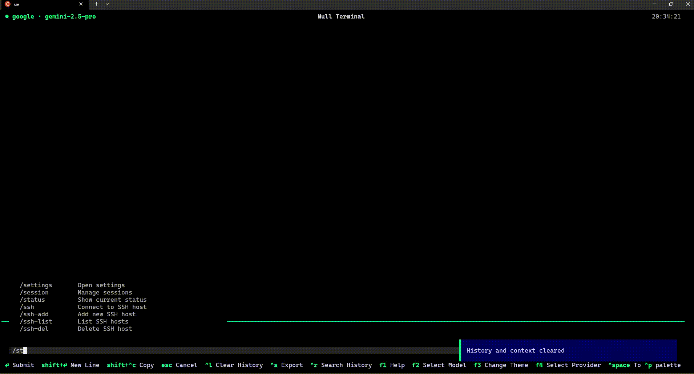

# Null Terminal

> **"Shell in the Void."**

[](https://www.python.org/downloads/)
[](https://textual.textualize.io/)

> [!NOTE]
> Null Terminal is under active development and not yet officially released. Features and APIs may change.

Null is a next-generation TUI (Terminal User Interface) designed for the modern AI-integrated workflow. Built on [Textual](https://textual.textualize.io/), it blends the raw power of the command line with the intelligence of LLMs, all wrapped in a sleek, cyber-noir aesthetic.

It is a **general-purpose, systems-focused** AI terminal and agent orchestrator, bridging the gap between manual shell operations and autonomous workflows.

<p align="center">
  
</p>

## Why Null?

- **Two Modes, One Interface**: Seamlessly switch between CLI and AI mode with `Ctrl+Space`
- **Block-Based Output**: Every command and response is a distinct, interactive block
- **20+ AI Providers**: From local Ollama to cloud providers like OpenAI, Anthropic, and Google
- **Agent Orchestration**: Let the AI execute multi-step system tasks autonomously
- **MCP Integration**: Extend AI capabilities with Model Context Protocol servers (Filesystem, Postgres, etc.)

---

## Features

### AI Integration

| Feature | Description |
|---------|-------------|
| **Multi-Provider** | Ollama, OpenAI, Anthropic, Google, Azure, Bedrock, Groq, Mistral, DeepSeek, and more |
| **Agent Mode** | Autonomous multi-step task execution with tool calling |
| **RAG / Knowledge Search** | Index your documentation or logs with `/index build` for semantic search |
| **Reasoning Display** | See the AI's thinking process for compatible models |
| **Context Inspector** | View exactly what the AI sees with `/context` |
| **Cost Tracking** | Real-time token usage and cost display in status bar |

### Ops & Admin Tools

| Feature | Description |
|---------|-------------|
| **Task Manager** | Integrated todo dashboard (`/todo`) for tracking maintenance tasks |
| **Prompt Editor** | Custom system prompts and personas (`/prompts`) |
| **Git Integration** | Branch and status in status bar |
| **File Explorer** | Sidebar file tree (`Ctrl+\`) |
| **Session Export** | Export incident reviews or audit logs to Markdown/JSON |
| **SSH Manager** | Save and connect to remote hosts |

### MCP (Model Context Protocol)

| Feature | Description |
|---------|-------------|
| **Server Catalog** | Pre-configured popular MCP servers |
| **Tool Discovery** | Automatic tool registration from servers |
| **Resource Access** | Read external resources (databases, cloud APIs) |
| **Management UI** | `/mcp` commands for full control |

### UX

| Feature | Description |
|---------|-------------|
| **Block Interface** | Distinct visual blocks for each interaction |
| **10+ Themes** | Null Dark, Monokai, Dracula, and custom themes |
| **Command Palette** | Quick access with `Ctrl+P` |
| **Interactive TUI** | Run `vim`, `htop`, `ssh` inside blocks |
| **History Search** | `Ctrl+R` for command history |

---

## Quick Start

### Installation

**Via pipx (Recommended):**
```bash
pipx install null-terminal
null
```

**Via Docker:**
```bash
docker run -it --rm ghcr.io/starhound/null-terminal:latest
```

**From Source:**
```bash
git clone https://github.com/starhound/null-terminal.git
cd null-terminal
uv sync
uv run main.py
```

See [Installation Guide](user/installation.md) for Windows, advanced options, and troubleshooting.

### First Run

1. **Configure AI Provider**: Type `/settings` or press `F3`
2. **Select a Model**: Press `F2` or type `/model`
3. **Toggle AI Mode**: Press `Ctrl+Space` to switch between CLI and AI

### Basic Usage

```bash
# CLI Mode (default)
ls -la                    # Run shell commands
cd /var/log               # Navigate directories

# AI Mode (Ctrl+Space to toggle)
Analyze this error log    # Ask questions
Write a backup script     # Get automation help

# Slash Commands (always available)
/help                     # Show help
/model                    # Select AI model
/agent                    # Toggle agent mode
/todo                     # Task manager
/theme dracula            # Change theme
```

---

## Keyboard Shortcuts

| Shortcut | Action |
|----------|--------|
| `Ctrl+Space` | Toggle CLI / AI mode |
| `Ctrl+P` | Command palette |
| `Ctrl+\` | Toggle file sidebar |
| `Ctrl+R` | History search |
| `Ctrl+F` | Search blocks |
| `Ctrl+L` | Clear history |
| `F1` | Help screen |
| `F2` | Model selector |
| `F3` | Theme selector |
| `F4` | Provider selector |
| `Escape` | Cancel / Close |

---

## AI Providers

### Local (Free)

| Provider | Setup |
|----------|-------|
| **Ollama** | `ollama pull llama3.2` then `/provider ollama` |
| **LM Studio** | Start server, then `/provider lm_studio` |
| **Llama.cpp** | Start server, then `/provider llama_cpp` |

### Cloud

| Provider | Models |
|----------|--------|
| **OpenAI** | GPT-4o, GPT-4 Turbo, o1 |
| **Anthropic** | Claude 3.5 Sonnet, Claude 3 Opus |
| **Google** | Gemini 2.0 Flash, Gemini 1.5 Pro |
| **Azure** | Azure OpenAI deployments |
| **AWS Bedrock** | Claude, Titan, Llama |
| **Groq** | Llama 3.3, Mixtral (fast) |
| **Mistral** | Mistral Large, Codestral |
| **DeepSeek** | DeepSeek Chat, DeepSeek Coder |

See [Providers Guide](user/providers.md) for full list and configuration.

---

## Agent Mode

Enable autonomous task execution:

```bash
/agent                    # Toggle agent mode

# Then ask:
"Scan /var/log/syslog for errors and generate a summary report in /tmp/report.md"
```

The agent will:
1. Plan the approach
2. Execute tools (read/write files, run commands)
3. Iterate until the task is complete

Safety features:
- Tool approval prompts for dangerous operations
- Maximum 10 iterations per task
- Cancel anytime with `Escape`

---

## MCP Integration

Add external tools via Model Context Protocol:

```bash
/mcp catalog              # Browse available servers
/mcp add                  # Add a server manually
/mcp tools                # List available tools
```

Popular MCP servers:
- **Brave Search** - Web search
- **Filesystem** - File operations
- **PostgreSQL** - Database queries
- **GitHub** - Repository management

---

## Configuration

Settings are stored in `~/.null/`:

| File | Purpose |
|------|---------|
| `config.json` | User preferences |
| `null.db` | Sessions, encrypted API keys |
| `mcp.json` | MCP server configs |
| `themes/` | Custom themes |
| `prompts/` | Custom system prompts |

---

## Documentation

| Guide | Description |
|-------|-------------|
| [User Guide](user/index.md) | Complete usage instructions |
| [Commands Reference](user/commands.md) | All slash commands |
| [Providers Guide](user/providers.md) | AI provider setup |
| [MCP Guide](user/mcp.md) | MCP server configuration |
| [Themes Guide](user/themes.md) | Customizing appearance |
| [SSH Guide](user/ssh.md) | Remote connections |

### For Contributors

| Guide | Description |
|-------|-------------|
| [Architecture](ARCHITECTURE.md) | System design overview |
| [Development](DEVELOPMENT.md) | Dev environment setup |
| [Contributing](contributing.md) | How to contribute |
| [Feature Specs](FEATURE_SPECS.md) | Planned features |

---

## Tech Stack

- **[Textual](https://textual.textualize.io/)** - TUI framework
- **[httpx](https://www.python-httpx.org/)** - Async HTTP client
- **Python 3.12+** - Async/await, type hints
- **SQLite** - Local storage
- **Fernet** - API key encryption

---

## Contributing

We welcome contributions! See [contributing.md](contributing.md) for guidelines.

```bash
# Development setup
git clone https://github.com/starhound/null-terminal.git
cd null-terminal
uv sync
uv run pytest                    # Run tests
uv run main.py                   # Run app
uv run textual console           # Debug console
```

<p align="center">
  Built with 🖤 by <a href="https://github.com/starhound">Starhound</a>
</p>

<p align="center">
  <a href="https://github.com/starhound/null-terminal/stargazers">Star us on GitHub</a>
</p>
